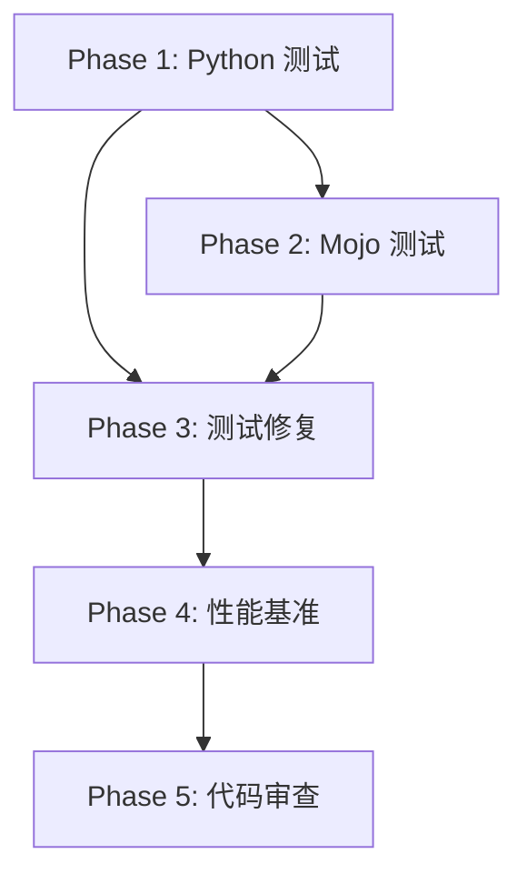

# ROADMAP.md

## Milestone: 集成验证与优化

### Phase 1: Python 测试套件验证
**Status**: ⏳ Pending
**Dependencies**: None
**Duration**: 1-2 hours

**Tasks**:
- [ ] 运行 Group 01-07 Python 测试
- [ ] 运行 Group 08 Python 测试
- [ ] 运行 Group 09 Python 测试
- [ ] 运行 Group 10-12 Python 测试
- [ ] 运行 Group 13 Python 测试
- [ ] 收集测试结果
- [ ] 分析失败测试

**Deliverables**:
- Python 测试报告
- 失败测试列表

---

### Phase 2: Mojo 测试套件验证
**Status**: ⏳ Pending
**Dependencies**: Phase 1
**Duration**: 2-3 hours

**Tasks**:
- [ ] 编译所有 Mojo 测试文件
- [ ] 运行 Group 01-07 Mojo 测试
- [ ] 运行 Group 08 Mojo 测试
- [ ] 运行 Group 09 Mojo 测试
- [ ] 运行 Group 10-12 Mojo 测试
- [ ] 运行 Group 13 Mojo 测试
- [ ] 收集测试结果
- [ ] 分析编译/运行错误

**Deliverables**:
- Mojo 测试报告
- 编译错误列表
- 运行错误列表

---

### Phase 3: 测试修复
**Status**: ⏳ Pending
**Dependencies**: Phase 1, Phase 2
**Duration**: 3-5 hours

**Tasks**:
- [ ] 修复 Python 测试失败
- [ ] 修复 Mojo 编译错误
- [ ] 修复 Mojo 运行错误
- [ ] 重新运行测试验证

**Deliverables**:
- 修复后的代码
- 测试通过报告

---

### Phase 4: 性能基准测试
**Status**: ⏳ Pending
**Dependencies**: Phase 3
**Duration**: 1-2 hours

**Tasks**:
- [ ] 设计性能基准测试用例
- [ ] 运行 Python 版本基准测试
- [ ] 运行 Mojo 版本基准测试
- [ ] 对比性能数据
- [ ] 生成性能报告

**Deliverables**:
- 性能基准报告
- 性能对比图表

---

### Phase 5: 代码审查与清理
**Status**: ⏳ Pending
**Dependencies**: Phase 4
**Duration**: 2-3 hours

**Tasks**:
- [ ] 代码风格检查
- [ ] 文档完整性检查
- [ ] 安全漏洞扫描
- [ ] 代码清理
- [ ] 最终验证

**Deliverables**:
- 代码审查报告
- 清理后的代码库

---

## Progress Summary

| Phase | Status | Progress |
|-------|--------|----------|
| Phase 1: Python 测试 | ⏳ Pending | 0% |
| Phase 2: Mojo 测试 | ⏳ Pending | 0% |
| Phase 3: 测试修复 | ⏳ Pending | 0% |
| Phase 4: 性能基准 | ⏳ Pending | 0% |
| Phase 5: 代码审查 | ⏳ Pending | 0% |

**Overall Milestone Progress**: 0%

---

## Dependencies Graph

---

## Test Groups Summary

| Group | Files | Dependencies | Python Tests | Mojo Tests |
|-------|-------|--------------|--------------|------------|
| Group 01 | 10 | 0 | ✅ Created | ✅ Created |
| Group 02 | 10 | 0-1 | ✅ Created | ✅ Created |
| Group 03 | 10 | 1-2 | ✅ Created | ✅ Created |
| Group 04 | 10 | 2 | ✅ Created | ✅ Created |
| Group 05 | 10 | 2 | ✅ Created | ✅ Created |
| Group 06 | 10 | 2-3 | ✅ Created | ✅ Created |
| Group 07 | 10 | 3-4 | ✅ Created | ✅ Created |
| Group 08 | 10 | 4 | ✅ Created | ✅ Created |
| Group 09 | 10 | 4-5 | ✅ Created | ✅ Created |
| Group 10 | 10 | 5-6 | ✅ Created | ✅ Created |
| Group 11 | 10 | 6 | ✅ Created | ✅ Created |
| Group 12 | 10 | 7-10 | ✅ Created | ✅ Created |
| Group 13 | 3 | 15+ | ✅ Created | ✅ Created |
| **Total** | **123** | - | **123** | **123** |
