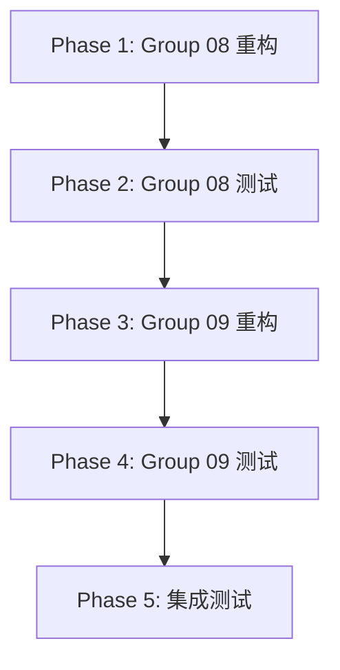

# ROADMAP.md

## Milestone: 业务层重构 (Group 08-09)

### Phase 1: Group 08 Mojo 重构
**Status**: ⏳ Pending
**Dependencies**: None
**Duration**: 2-3 hours

**Tasks**:
- [ ] 重构 `cmds/run.mojo`
- [ ] 重构 `core/strategy_context.mojo`
- [ ] 重构 `data/base_data_source/storage_interface.mojo`
- [ ] 重构 `data/instruments_mixin.mojo`
- [ ] 重构 `data/trading_dates_mixin.mojo`
- [ ] 重构 `mod/__init__.mojo`
- [ ] 重构 `mod/rqalpha_mod_sys_accounts/component_validator.mojo`
- [ ] 重构 `mod/rqalpha_mod_sys_accounts/validator.mojo`
- [ ] 重构 `mod/rqalpha_mod_sys_analyser/mod.mojo`
- [ ] 重构 `mod/rqalpha_mod_sys_analyser/plot_store.mojo`

**Deliverables**:
- 10 个 Mojo 源文件
- 编译通过验证

---

### Phase 2: Group 08 测试验证
**Status**: ⏳ Pending
**Dependencies**: Phase 1
**Duration**: 1-2 hours

**Tasks**:
- [ ] 创建/更新 Group 08 Mojo 测试文件
- [ ] 运行 Mojo 测试
- [ ] 修复测试失败
- [ ] 验证功能一致性

**Deliverables**:
- Group 08 测试报告
- 修复后的代码

---

### Phase 3: Group 09 Mojo 重构
**Status**: ⏳ Pending
**Dependencies**: Phase 2
**Duration**: 2-3 hours

**Tasks**:
- [ ] 重构 `mod/rqalpha_mod_sys_analyser/report/report.mojo`
- [ ] 重构 `mod/rqalpha_mod_sys_risk/validators/price_validator.mojo`
- [ ] 重构 `mod/rqalpha_mod_sys_risk/validators/self_trade_validator.mojo`
- [ ] 重构 `mod/rqalpha_mod_sys_scheduler/scheduler.mojo`
- [ ] 重构 `mod/rqalpha_mod_sys_simulation/mod.mojo`
- [ ] 重构 `mod/rqalpha_mod_sys_simulation/signal_broker.mojo`
- [ ] 重构 `mod/rqalpha_mod_sys_simulation/testing.mojo`
- [ ] 重构 `model/instrument.mojo`
- [ ] 重构 `core/strategy.mojo`
- [ ] 重构 `data/bundle.mojo`

**Deliverables**:
- 10 个 Mojo 源文件
- 编译通过验证

---

### Phase 4: Group 09 测试验证
**Status**: ⏳ Pending
**Dependencies**: Phase 3
**Duration**: 1-2 hours

**Tasks**:
- [ ] 创建/更新 Group 09 Mojo 测试文件
- [ ] 运行 Mojo 测试
- [ ] 修复测试失败
- [ ] 验证功能一致性

**Deliverables**:
- Group 09 测试报告
- 修复后的代码

---

### Phase 5: 集成测试
**Status**: ⏳ Pending
**Dependencies**: Phase 4
**Duration**: 1-2 hours

**Tasks**:
- [ ] 运行完整 Mojo 测试套件
- [ ] 验证跨模块依赖
- [ ] 性能基准测试
- [ ] 文档更新

**Deliverables**:
- 完整测试报告
- 性能对比报告
- 更新后的文档

---

## Progress Summary

| Phase | Status | Progress |
|-------|--------|----------|
| Phase 1: Group 08 重构 | ⏳ Pending | 0% |
| Phase 2: Group 08 测试 | ⏳ Pending | 0% |
| Phase 3: Group 09 重构 | ⏳ Pending | 0% |
| Phase 4: Group 09 测试 | ⏳ Pending | 0% |
| Phase 5: 集成测试 | ⏳ Pending | 0% |

**Overall Milestone Progress**: 0%

---

## Dependencies Graph

---

## Files Summary

### Group 08 Files (10 files)

| File | Dependencies | Status |
|------|--------------|--------|
| `cmds/run.mojo` | 4 | ⏳ Pending |
| `core/strategy_context.mojo` | 4 | ⏳ Pending |
| `data/base_data_source/storage_interface.mojo` | 4 | ⏳ Pending |
| `data/instruments_mixin.mojo` | 4 | ⏳ Pending |
| `data/trading_dates_mixin.mojo` | 4 | ⏳ Pending |
| `mod/__init__.mojo` | 4 | ⏳ Pending |
| `mod/rqalpha_mod_sys_accounts/component_validator.mojo` | 4 | ⏳ Pending |
| `mod/rqalpha_mod_sys_accounts/validator.mojo` | 4 | ⏳ Pending |
| `mod/rqalpha_mod_sys_analyser/mod.mojo` | 4 | ⏳ Pending |
| `mod/rqalpha_mod_sys_analyser/plot_store.mojo` | 4 | ⏳ Pending |

### Group 09 Files (10 files)

| File | Dependencies | Status |
|------|--------------|--------|
| `mod/rqalpha_mod_sys_analyser/report/report.mojo` | 4 | ⏳ Pending |
| `mod/rqalpha_mod_sys_risk/validators/price_validator.mojo` | 4 | ⏳ Pending |
| `mod/rqalpha_mod_sys_risk/validators/self_trade_validator.mojo` | 4 | ⏳ Pending |
| `mod/rqalpha_mod_sys_scheduler/scheduler.mojo` | 4 | ⏳ Pending |
| `mod/rqalpha_mod_sys_simulation/mod.mojo` | 4 | ⏳ Pending |
| `mod/rqalpha_mod_sys_simulation/signal_broker.mojo` | 4 | ⏳ Pending |
| `mod/rqalpha_mod_sys_simulation/testing.mojo` | 4 | ⏳ Pending |
| `model/instrument.mojo` | 4 | ⏳ Pending |
| `core/strategy.mojo` | 5 | ⏳ Pending |
| `data/bundle.mojo` | 5 | ⏳ Pending |

---

## Next Milestone Preview

### Milestone 4: 入口层重构 (Group 13)

**Files**:
- `main.mojo` (15 dependencies)
- `__init__.mojo` (20 dependencies)
- `utils/testing/integration.mojo` (1 dependency)

**Dependencies**: Milestone 3 完成
