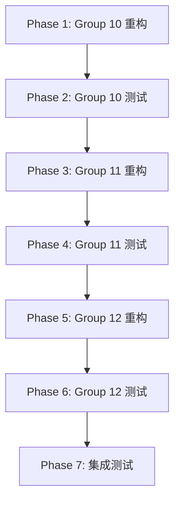

# ROADMAP.md

## Milestone: 高级业务层重构 (Group 10-12)

### Phase 1: Group 10 Mojo 重构
**Status**: ⏳ Pending
**Dependencies**: None
**Duration**: 2-3 hours

**Tasks**:
- [ ] 重构 `interface.mojo` - 依赖数量 5
- [ ] 重构 `mod/rqmojo_mod_sys_accounts/mod.mojo` - 依赖数量 5
- [ ] 重构 `mod/rqmojo_mod_sys_accounts/position_validator.mojo` - 依赖数量 5
- [ ] 重构 `mod/rqmojo_mod_sys_analyser/plot/plot.mojo` - 依赖数量 5
- [ ] 重构 `mod/rqmojo_mod_sys_simulation/matcher.mojo` - 依赖数量 5
- [ ] 重构 `mod/rqmojo_mod_sys_simulation/simulation_event_source.mojo` - 依赖数量 5
- [ ] 重构 `model/order.mojo` - 依赖数量 5
- [ ] 重构 `model/trade.mojo` - 依赖数量 5
- [ ] 重构 `utils/__init__.mojo` - 依赖数量 5
- [ ] 重构 `apis/__init__.mojo` - 依赖数量 6

**Deliverables**:
- 10 个 Mojo 源文件
- 编译通过验证

---

### Phase 2: Group 10 测试验证
**Status**: ⏳ Pending
**Dependencies**: Phase 1
**Duration**: 1-2 hours

**Tasks**:
- [ ] 创建/更新 Group 10 Mojo 测试文件
- [ ] 运行 Mojo 测试
- [ ] 修复测试失败
- [ ] 验证功能一致性

**Deliverables**:
- Group 10 测试报告
- 修复后的代码

---

### Phase 3: Group 11 Mojo 重构
**Status**: ⏳ Pending
**Dependencies**: Phase 2
**Duration**: 2-3 hours

**Tasks**:
- [ ] 重构 `apis/api_abstract.mojo` - 依赖数量 6
- [ ] 重构 `cmds/__init__.mojo` - 依赖数量 6
- [ ] 重构 `environment.mojo` - 依赖数量 6
- [ ] 重构 `mod/rqmojo_mod_sys_risk/validators/cash_validator.mojo` - 依赖数量 6
- [ ] 重构 `mod/rqmojo_mod_sys_risk/validators/is_trading_validator.mojo` - 依赖数量 6
- [ ] 重构 `mod/rqmojo_mod_sys_simulation/simulation_broker.mojo` - 依赖数量 6
- [ ] 重构 `mod/rqmojo_mod_sys_accounts/api/order_target_portfolio.mojo` - 依赖数量 6
- [ ] 重构 `mod/rqmojo_mod_sys_accounts/api/api_future.mojo` - 依赖数量 6
- [ ] 重构 `model/bar.mojo` - 依赖数量 6
- [ ] 重构 `data/base_data_source/storages.mojo` - 依赖数量 6

**Deliverables**:
- 10 个 Mojo 源文件
- 编译通过验证

---

### Phase 4: Group 11 测试验证
**Status**: ⏳ Pending
**Dependencies**: Phase 3
**Duration**: 1-2 hours

**Tasks**:
- [ ] 创建/更新 Group 11 Mojo 测试文件
- [ ] 运行 Mojo 测试
- [ ] 修复测试失败
- [ ] 验证功能一致性

**Deliverables**:
- Group 11 测试报告
- 修复后的代码

---

### Phase 5: Group 12 Mojo 重构
**Status**: ⏳ Pending
**Dependencies**: Phase 4
**Duration**: 2-3 hours

**Tasks**:
- [ ] 重构 `mod/rqmojo_mod_sys_accounts/api/api_stock.mojo` - 依赖数量 7
- [ ] 重构 `apis/api_rqdatac.mojo` - 依赖数量 7
- [ ] 重构 `mod/rqmojo_mod_sys_accounts/position_model.mojo` - 依赖数量 8
- [ ] 重构 `data/data_proxy.mojo` - 依赖数量 8
- [ ] 重构 `portfolio/__init__.mojo` - 依赖数量 8
- [ ] 重构 `portfolio/position.mojo` - 依赖数量 8
- [ ] 重构 `portfolio/account.mojo` - 依赖数量 8
- [ ] 重构 `apis/api_base.mojo` - 依赖数量 9
- [ ] 重构 `utils/testing/fixtures.mojo` - 依赖数量 9
- [ ] 重构 `data/base_data_source/data_source.mojo` - 依赖数量 10

**Deliverables**:
- 10 个 Mojo 源文件
- 编译通过验证

---

### Phase 6: Group 12 测试验证
**Status**: ⏳ Pending
**Dependencies**: Phase 5
**Duration**: 1-2 hours

**Tasks**:
- [ ] 创建/更新 Group 12 Mojo 测试文件
- [ ] 运行 Mojo 测试
- [ ] 修复测试失败
- [ ] 验证功能一致性

**Deliverables**:
- Group 12 测试报告
- 修复后的代码

---

### Phase 7: 集成测试
**Status**: ⏳ Pending
**Dependencies**: Phase 6
**Duration**: 1-2 hours

**Tasks**:
- [ ] 运行完整 Mojo 测试套件
- [ ] 验证跨模块依赖
- [ ] 性能基准测试
- [ ] 文档更新

**Deliverables**:
- 完整测试报告
- 性能对比报告
- 更新后的文档

---

## Progress Summary

| Phase | Status | Progress |
|-------|--------|----------|
| Phase 1: Group 10 重构 | ⏳ Pending | 0% |
| Phase 2: Group 10 测试 | ⏳ Pending | 0% |
| Phase 3: Group 11 重构 | ⏳ Pending | 0% |
| Phase 4: Group 11 测试 | ⏳ Pending | 0% |
| Phase 5: Group 12 重构 | ⏳ Pending | 0% |
| Phase 6: Group 12 测试 | ⏳ Pending | 0% |
| Phase 7: 集成测试 | ⏳ Pending | 0% |

**Overall Milestone Progress**: 0%

---

## Dependencies Graph

---

## Files Summary

### Group 10 Files (10 files)

| File | Dependencies | Status |
|------|--------------|--------|
| `interface.mojo` | 5 | ⏳ Pending |
| `mod/rqmojo_mod_sys_accounts/mod.mojo` | 5 | ⏳ Pending |
| `mod/rqmojo_mod_sys_accounts/position_validator.mojo` | 5 | ⏳ Pending |
| `mod/rqmojo_mod_sys_analyser/plot/plot.mojo` | 5 | ⏳ Pending |
| `mod/rqmojo_mod_sys_simulation/matcher.mojo` | 5 | ⏳ Pending |
| `mod/rqmojo_mod_sys_simulation/simulation_event_source.mojo` | 5 | ⏳ Pending |
| `model/order.mojo` | 5 | ⏳ Pending |
| `model/trade.mojo` | 5 | ⏳ Pending |
| `utils/__init__.mojo` | 5 | ⏳ Pending |
| `apis/__init__.mojo` | 6 | ⏳ Pending |

### Group 11 Files (10 files)

| File | Dependencies | Status |
|------|--------------|--------|
| `apis/api_abstract.mojo` | 6 | ⏳ Pending |
| `cmds/__init__.mojo` | 6 | ⏳ Pending |
| `environment.mojo` | 6 | ⏳ Pending |
| `mod/rqmojo_mod_sys_risk/validators/cash_validator.mojo` | 6 | ⏳ Pending |
| `mod/rqmojo_mod_sys_risk/validators/is_trading_validator.mojo` | 6 | ⏳ Pending |
| `mod/rqmojo_mod_sys_simulation/simulation_broker.mojo` | 6 | ⏳ Pending |
| `mod/rqmojo_mod_sys_accounts/api/order_target_portfolio.mojo` | 6 | ⏳ Pending |
| `mod/rqmojo_mod_sys_accounts/api/api_future.mojo` | 6 | ⏳ Pending |
| `model/bar.mojo` | 6 | ⏳ Pending |
| `data/base_data_source/storages.mojo` | 6 | ⏳ Pending |

### Group 12 Files (10 files)

| File | Dependencies | Status |
|------|--------------|--------|
| `mod/rqmojo_mod_sys_accounts/api/api_stock.mojo` | 7 | ⏳ Pending |
| `apis/api_rqdatac.mojo` | 7 | ⏳ Pending |
| `mod/rqmojo_mod_sys_accounts/position_model.mojo` | 8 | ⏳ Pending |
| `data/data_proxy.mojo` | 8 | ⏳ Pending |
| `portfolio/__init__.mojo` | 8 | ⏳ Pending |
| `portfolio/position.mojo` | 8 | ⏳ Pending |
| `portfolio/account.mojo` | 8 | ⏳ Pending |
| `apis/api_base.mojo` | 9 | ⏳ Pending |
| `utils/testing/fixtures.mojo` | 9 | ⏳ Pending |
| `data/base_data_source/data_source.mojo` | 10 | ⏳ Pending |

---

## Next Milestone Preview

### Milestone 3: 入口层重构 (Group 13)

**Files**:
- `main.mojo` (15 dependencies)
- `__init__.mojo` (20 dependencies)
- `utils/testing/integration.mojo` (1 dependency)

**Dependencies**: Milestone 2 完成
