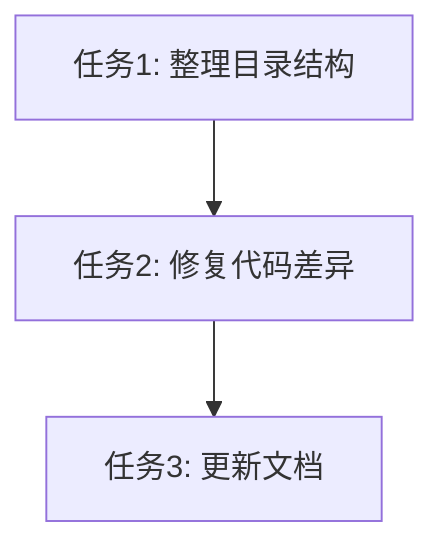

# PLAN: 整理测试文件并修复第一组差异

**阶段编号**: 78.1
**创建日期**: 2026-03-26
**状态**: 待执行

---

## 目标

1. 整理 `/home/zhou/hello_mojo/trae_cn_78/mojo_refactor/tests` 目录下的 Python 和 Mojo 测试文件及 MD 测试结果文件，确保文件名和位置一致且对应
2. 分析第一组（group_01）中 Mojo 和 Python 代码差异的原因，进行修复，尽量保持一致

---

## 背景

根据依赖分析报告，第一组包含 10 个无依赖的基础模块，已全部完成测试。测试结果显示：
- Python 测试通过率: 98.3% (58/59)
- Mojo 测试通过率: 100% (72/72)

存在以下待修复问题：
1. `cmds/entry.mojo` 缺少帮助系统 (-h/--help)
2. 测试文件位置不一致，需要整理

---

## 任务清单

### 任务 1: 整理测试文件目录结构

**目标**: 确保 Python 测试、Mojo 测试和 MD 结果文件位置一致

**当前问题**:
- Python 测试文件分散在 `tests/python/` 根目录和子目录中
- Mojo 测试文件分散在 `tests/mojo/` 根目录和子目录中
- MD 结果文件在 `tests/results/group_01/` 中

**期望结构**:
```
tests/
├── python/
│   ├── group_01/           # 第一组测试
│   │   ├── test_version.py
│   │   ├── test_cmds_entry.py
│   │   ├── test_user_module.py
│   │   ├── test_click_helper.py
│   │   ├── test_concurrent.py
│   │   ├── test_log_capture.py
│   │   ├── test_package_helper.py
│   │   ├── test_repr.py
│   │   ├── test_typing.py
│   │   └── test_persist_helper.py
│   ├── group_02/           # 第二组测试
│   └── ...
├── mojo/
│   ├── group_01/           # 第一组测试
│   │   ├── test_version.mojo
│   │   ├── test_cmds_entry.mojo
│   │   ├── test_user_module.mojo
│   │   ├── test_click_helper.mojo
│   │   ├── test_concurrent.mojo
│   │   ├── test_log_capture.mojo
│   │   ├── test_package_helper.mojo
│   │   ├── test_repr.mojo
│   │   ├── test_typing.mojo
│   │   └── test_persist_helper.mojo
│   ├── group_02/           # 第二组测试
│   └── ...
└── results/
    ├── group_01/           # 第一组结果
    │   ├── SUMMARY.md
    │   ├── 01_version.md
    │   ├── 02_cmds_entry.md
    │   └── ...
    ├── group_02/           # 第二组结果
    └── ...
```

**步骤**:
- [ ] 创建 `tests/python/group_01/` 目录
- [ ] 创建 `tests/mojo/group_01/` 目录
- [ ] 移动第一组 Python 测试文件到对应目录
- [ ] 移动第一组 Mojo 测试文件到对应目录
- [ ] 验证文件移动后测试仍可运行

---

### 任务 2: 分析并修复第一组代码差异

**目标**: 分析 group_01 中 Mojo 和 Python 代码差异，修复可修复的差异

**差异分析摘要**:

| 文件 | 差异类型 | 可修复 | 优先级 |
|------|----------|--------|--------|
| `_version.mojo` | 已修复 | ✅ | - |
| `cmds/entry.mojo` | 缺少帮助系统 | ✅ | 高 |
| `user_module.mojo` | Mojo 更完整 | ❌ (正向差异) | - |
| `utils/click_helper.mojo` | 返回类型不同 | ⚠️ (语言差异) | 中 |
| `utils/concurrent.mojo` | 缺少 ProcessPoolExecutor | ❌ (语言限制) | - |
| `utils/log_capture.mojo` | 上下文管理实现不同 | ⚠️ (语言差异) | 低 |
| `utils/package_helper.mojo` | 返回类型不同 | ⚠️ (语言差异) | 低 |
| `utils/repr.mojo` | 架构不同 (元类 vs trait) | ❌ (语言差异) | - |
| `utils/typing.mojo` | 类型系统不同 | ❌ (语言差异) | - |
| `utils/persist_helper.mojo` | Mojo 新增 | ❌ (正向差异) | - |

**待修复项**:

#### 2.1 修复 `cmds/entry.mojo` 帮助系统

**问题**: Mojo 版本缺少 `-h/--help` 支持

**修复方案**:
```mojo
def show_help() -> None:
    print("Usage: rqmojo [COMMAND] [OPTIONS]")
    print("")
    print("Commands:")
    print("  run      Run backtest")
    print("  bundle   Manage data bundle")
    print("  mod      Manage modules")
    print("")
    print("Options:")
    print("  -h, --help  Show this help message")

# 在 CliRunner.run() 中添加:
if command == "help" or command == "--help" or command == "-h":
    show_help()
    return 0
```

**步骤**:
- [ ] 在 `cmds/entry.mojo` 中添加 `show_help()` 函数
- [ ] 在 `CliRunner.run()` 中添加帮助命令处理
- [ ] 更新测试用例验证帮助功能
- [ ] 运行测试确认修复

---

### 任务 3: 更新测试结果文档

**目标**: 更新 MD 测试结果文件，反映修复后的状态

**步骤**:
- [ ] 重新运行第一组所有测试
- [ ] 更新 `tests/results/group_01/SUMMARY.md`
- [ ] 更新 `tests/results/group_01/02_cmds_entry.md`
- [ ] 确保所有测试结果文档准确反映当前状态

---

## 验收标准

1. **目录结构**:
   - [ ] `tests/python/group_01/` 包含 10 个 Python 测试文件
   - [ ] `tests/mojo/group_01/` 包含 10 个 Mojo 测试文件
   - [ ] `tests/results/group_01/` 包含 SUMMARY.md 和 10 个详细报告

2. **测试通过**:
   - [ ] 所有 Python 测试通过
   - [ ] 所有 Mojo 测试通过
   - [ ] `cmds/entry.mojo` 支持 `-h/--help`

3. **文档更新**:
   - [ ] SUMMARY.md 反映最新测试结果
   - [ ] 所有差异报告准确

---

## 依赖关系



---

## 风险评估

| 风险 | 影响 | 缓解措施 |
|------|------|----------|
| 移动文件后测试路径失效 | 中 | 更新测试文件中的 import 路径 |
| 帮助系统实现不完整 | 低 | 参考 argmojo 库实现 |

---

## 执行计划

1. **阶段 1**: 整理目录结构 (预计 15 分钟)
2. **阶段 2**: 修复代码差异 (预计 30 分钟)
3. **阶段 3**: 更新文档 (预计 15 分钟)

**总预计时间**: 60 分钟
