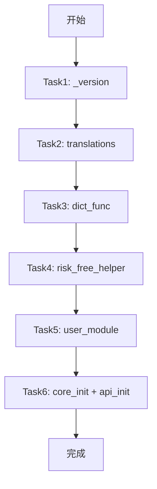

# Stdlib-Only Files Mojo Refactor Plan

> **For agentic workers:** REQUIRED SUB-SKILL: Use superpowers:subagent-driven-development (recommended) or superpowers:executing-plans to implement this plan task-by-task. Steps use checkbox (`- [ ]`) syntax for tracking.

**Goal:** 将rqalpha中11个只依赖标准库的Python文件重构为Mojo，并在tests目录创建Python和Mojo测试，保存MD格式测试结果

**Architecture:** 按照L00层级（叶子模块）组织，这些是无外部依赖的核心模块，适合优先重构

**Tech Stack:** Mojo 0.26.2.0, Python 3.14 (UV), pytest

---

## 文件分析

| # | Python文件 | 复杂度 | 已有Mojo? | 说明 |
|---|-----------|-------|---------|------|
| 1 | `_version.py` | 低 | 是 | 版本信息，仅常量 |
| 2 | `const.py` | 中 | 部分 | 多个枚举类，CustomEnumMeta元类 |
| 3 | `core/__init__.py` | 极低 | 是 | 仅版权声明 |
| 4 | `core/events.py` | 中 | 是 | Event类、EventBus类、EVENT枚举 |
| 5 | `mod/.../api/__init__.py` | 极低 | 是 | 仅版权声明 |
| 6 | `user_module.py` | 低 | 是 | 仅版权声明 |
| 7 | `utils/dict_func.py` | 低 | 是 | deep_update函数 |
| 8 | `utils/risk_free_helper.py` | 中 | 是 | 收益率曲线相关函数 |
| 9 | `utils/translations/__init__.py` | 极低 | 否 | 仅版权声明 |
| 10 | `utils/translations/zh_Hans_CN/__init__.py` | 极低 | 否 | 仅版权声明 |
| 11 | `utils/translations/zh_Hans_CN/LC_MESSAGES/__init__.py` | 极低 | 否 | 仅版权声明 |

---

## 目录结构

```
mojo_refactor/
├── rqmojo/
│   ├── _version.mojo                    # 已存在
│   ├── const.mojo                       # 已部分存在，需完善
│   ├── core/
│   │   ├── __init__.mojo               # 需创建
│   │   └── events.mojo                  # 已存在
│   ├── mod/rqalpha_mod_sys_accounts/api/
│   │   └── __init__.mojo               # 需创建
│   ├── user_module.mojo                 # 已存在
│   └── utils/
│       ├── dict_func.mojo               # 已存在
│       ├── risk_free_helper.mojo        # 已存在
│       └── translations/
│           ├── __init__.mojo           # 需创建
│           ├── zh_Hans_CN/
│           │   ├── __init__.mojo       # 需创建
│           │   └── LC_MESSAGES/
│           │       └── __init__.mojo   # 需创建

tests/
├── python_test_rqalpha/L00_leaf/        # Python测试
│   ├── test_L00_01_const.py            # 已存在
│   ├── test_L00_10_version.py          # 需创建
│   ├── test_L00_11_events.py           # 已存在
│   └── test_L00_12_user_module.py      # 需创建
├── python_test_rqalpha/L00_leaf/translations/  # 需创建子目录
│   ├── test_L00_13_translations.py     # 需创建
│   ├── test_L00_14_zh_cn.py           # 需创建
│   └── test_L00_15_lc_messages.py     # 需创建
├── python_test_rqalpha/L01_utils/
│   ├── test_L01_06_dict_func.py        # 需创建
│   └── test_L01_07_risk_free_helper.py # 需创建
├── mojo_test_rqmojo/L00_leaf/          # Mojo测试
│   ├── test_L00_01_const.mojo          # 已存在
│   ├── test_L00_10_version.mojo       # 需创建
│   ├── test_L00_11_events.mojo         # 已存在
│   ├── test_L00_12_user_module.mojo    # 需创建
│   └── translations/                   # 需创建
│       ├── test_L00_13_translations.mojo
│       ├── test_L00_14_zh_cn.mojo
│       └── test_L00_15_lc_messages.mojo
├── mojo_test_rqmojo/L01_utils/
│   ├── test_L01_06_dict_func.mojo      # 需创建
│   └── test_L01_07_risk_free_helper.mojo  # 需创建
└── test_results/                        # 测试结果MD
    ├── L00_10_version_test_result.md
    ├── L00_11_events_test_result.md
    ├── L00_12_user_module_test_result.md
    ├── L00_13_translations_test_result.md
    ├── L00_14_zh_cn_test_result.md
    ├── L00_15_lc_messages_test_result.md
    ├── L01_06_dict_func_test_result.md
    └── L01_07_risk_free_helper_test_result.md
```

---

## 任务分解

### Task 1: _version 模块

**文件:**
- 创建: `rqmojo/_version.mojo` (已存在)
- 创建: `tests/python_test_rqalpha/L00_leaf/test_L00_10_version.py`
- 创建: `tests/mojo_test_rqmojo/L00_leaf/test_L00_10_version.mojo`
- 创建: `tests/test_results/L00_10_version_test_result.md`

- [ ] **Step 1: 创建Python测试文件**

```python
# test_L00_10_version.py
from rqalpha import _version

def test_version():
    assert hasattr(_version, '__version__')
    assert hasattr(_version, 'version')
    assert _version.__version__ == _version.version
```

- [ ] **Step 2: 运行Python测试验证**

Run: `/home/zhou/hello_mojo/trae_cn_78/.venv/bin/python -m pytest tests/python_test_rqalpha/L00_leaf/test_L00_10_version.py -v`

- [ ] **Step 3: 创建Mojo测试文件**
- [ ] **Step 4: 运行Mojo测试验证**
- [ ] **Step 5: 生成测试结果MD**

---

### Task 2: translations 模块 (3个版权声明文件)

**文件:**
- 创建: `rqmojo/utils/translations/__init__.mojo`
- 创建: `rqmojo/utils/translations/zh_Hans_CN/__init__.mojo`
- 创建: `rqmojo/utils/translations/zh_Hans_CN/LC_MESSAGES/__init__.mojo`
- 创建: Python/Mojo测试文件 (简化版，仅测试模块可导入)
- 创建: 测试结果MD

- [ ] **Step 1: 创建Mojo版权声明文件**
- [ ] **Step 2: 创建测试文件**
- [ ] **Step 3: 运行测试**
- [ ] **Step 4: 生成MD**

---

### Task 3: dict_func 模块

**文件:**
- 修改: `rqmojo/utils/dict_func.mojo` (已存在，需验证)
- 创建: `tests/python_test_rqalpha/L01_utils/test_L01_06_dict_func.py`
- 创建: `tests/mojo_test_rqmojo/L01_utils/test_L01_06_dict_func.mojo`
- 创建: `tests/test_results/L01_06_dict_func_test_result.md`

- [ ] **Step 1: 验证现有Mojo实现**
- [ ] **Step 2: 创建Python测试**
- [ ] **Step 3: 运行Python测试**
- [ ] **Step 4: 创建Mojo测试**
- [ ] **Step 5: 运行Mojo测试**
- [ ] **Step 6: 生成MD**

---

### Task 4: risk_free_helper 模块

**文件:**
- 修改: `rqmojo/utils/risk_free_helper.mojo` (已存在，需验证依赖)
- 创建: `tests/python_test_rqalpha/L01_utils/test_L01_07_risk_free_helper.py`
- 创建: `tests/mojo_test_rqmojo/L01_utils/test_L01_07_risk_free_helper.mojo`
- 创建: `tests/test_results/L01_07_risk_free_helper_test_result.md`

- [ ] **Step 1: 检查datetime_func依赖**
- [ ] **Step 2: 创建Python测试**
- [ ] **Step 3: 运行Python测试**
- [ ] **Step 4: 创建Mojo测试**
- [ ] **Step 5: 运行Mojo测试**
- [ ] **Step 6: 生成MD**

---

### Task 5: user_module 模块

**文件:**
- 验证: `rqmojo/user_module.mojo` (已存在)
- 创建: `tests/python_test_rqalpha/L00_leaf/test_L00_12_user_module.py`
- 创建: `tests/mojo_test_rqmojo/L00_leaf/test_L00_12_user_module.mojo`
- 创建: `tests/test_results/L00_12_user_module_test_result.md`

- [ ] **Step 1: 验证现有实现**
- [ ] **Step 2: 创建测试**
- [ ] **Step 3: 运行测试**
- [ ] **Step 4: 生成MD**

---

### Task 6: core/__init__ 和 mod/.../api/__init__

**文件:**
- 创建: `rqmojo/core/__init__.mojo`
- 创建: `rqmojo/mod/rqalpha_mod_sys_accounts/api/__init__.mojo`
- 创建: 简化测试 (仅验证模块导入)

- [ ] **Step 1: 创建版权声明Mojo文件**
- [ ] **Step 2: 创建测试**
- [ ] **Step 3: 运行测试**
- [ ] **Step 4: 生成MD**

---

## 验收标准

1. 所有11个Python文件都有对应的Mojo实现
2. 每个模块都有Python测试文件和Mojo测试文件
3. 每个模块的测试结果保存为MD格式
4. Python测试使用 `/home/zhou/hello_mojo/trae_cn_78/.venv/bin/python -m pytest`
5. Mojo测试使用: `LD_PRELOAD=... PYTHONPATH=... /home/zhou/hello_mojo/trae_cn_78/.venv/bin/mojo run -I . <file.mojo>`
6. 测试结果包含：测试命令、输出、总结

---

## 运行命令参考

```bash
# Python测试
/home/zhou/hello_mojo/trae_cn_78/.venv/bin/python -m pytest tests/python_test_rqalpha/L00_leaf/test_L00_10_version.py -v

# Mojo测试
LD_PRELOAD=/home/zzhou/.local/share/uv/python/cpython-3.14.3-linux-x86_64-gnu/lib/libpython3.14.so PYTHONPATH=/home/zhou/hello_mojo/trae_cn_78/.venv/lib/python3.14/site-packages /home/zhou/hello_mojo/trae_cn_78/.venv/bin/mojo run -I . tests/mojo_test_rqmojo/L00_leaf/test_L00_10_version.mojo
```

---

## 任务依赖图


