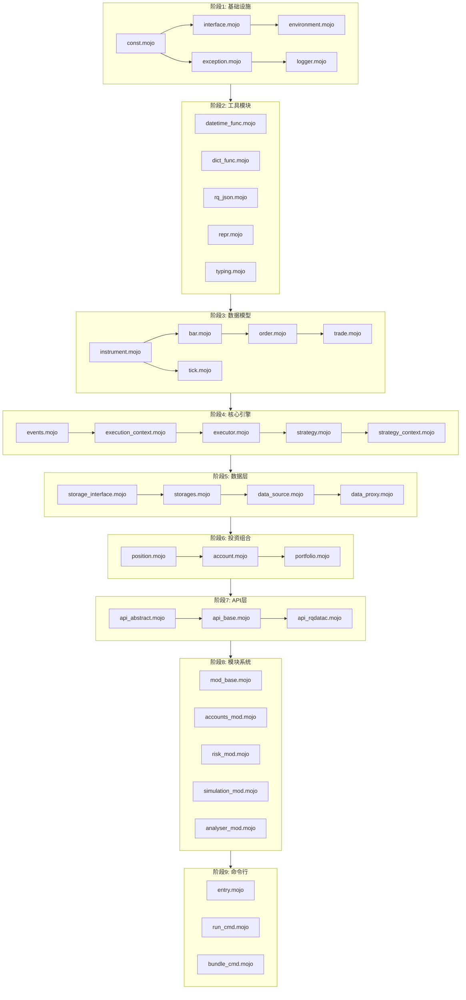

# RQAlpha 到 Mojo 重构计划

## 项目概述

将 Python 量化交易框架 **rqalpha** 重构为 **Mojo** 语言。

- **源代码位置**: `/home/zhou/hello_mojo/.venv/lib/python3.14/site-packages/rqalpha`
- **Python 文件总数**: 140 个
- **目标**: 每个 Python 文件对应一个 Mojo 文件和一个测试文件

## 模块结构分析

### 1. 核心模块 (core) - 7 个文件

```
core/
├── __init__.py
├── events.py           # 事件系统
├── execution_context.py # 执行上下文
├── executor.py         # 执行器
├── global_var.py       # 全局变量
├── strategy.py         # 策略基类
├── strategy_context.py # 策略上下文
├── strategy_loader.py  # 策略加载器
└── strategy_universe.py # 策略宇宙
```

### 2. 数据模块 (data) - 10 个文件

```
data/
├── __init__.py
├── bar_dict_price_board.py
├── bundle.py
├── data_proxy.py
├── instruments_mixin.py
├── trading_dates_mixin.py
└── base_data_source/
    ├── __init__.py
    ├── adjust.py
    ├── data_source.py
    ├── deprecated.py
    ├── storage_interface.py
    └── storages.py
```

### 3. 模型模块 (model) - 5 个文件

```
model/
├── __init__.py
├── bar.py          # K线数据
├── instrument.py   # 证券工具
├── order.py        # 订单
├── tick.py         # Tick数据
└── trade.py        # 成交记录
```

### 4. 投资组合模块 (portfolio) - 3 个文件

```
portfolio/
├── __init__.py
├── account.py      # 账户
└── position.py     # 持仓
```

### 5. 工具模块 (utils) - 18 个文件

```
utils/
├── __init__.py
├── arg_checker.py
├── class_helper.py
├── click_helper.py
├── concurrent.py
├── config.py
├── datetime_func.py
├── dict_func.py
├── exception.py
├── functools.py
├── i18n.py
├── log_capture.py
├── logger.py
├── package_helper.py
├── persisit_helper.py
├── repr.py
├── risk_free_helper.py
├── rq_json.py
├── strategy_loader_help.py
└── testing/
    ├── __init__.py
    ├── fixtures.py
    ├── integration.py
    └── mocking.py
```

### 6. API 模块 (apis) - 5 个文件

```
apis/
├── __init__.py
├── api_abstract.py
├── api_base.py
├── api_rqdatac.py
└── names.py
```

### 7. 命令模块 (cmds) - 6 个文件

```
cmds/
├── __init__.py
├── bundle.py
├── entry.py
├── misc.py
├── mod.py
└── run.py
```

### 8. 模块系统 (mod) - 约 40 个文件

```
mod/
├── __init__.py
├── utils.py
├── rqalpha_mod_sys_accounts/      # 账户模块
├── rqalpha_mod_sys_analyser/      # 分析模块
├── rqalpha_mod_sys_progress/      # 进度模块
├── rqalpha_mod_sys_risk/          # 风控模块
├── rqalpha_mod_sys_scheduler/     # 调度模块
├── rqalpha_mod_sys_simulation/    # 模拟模块
└── rqalpha_mod_sys_transaction_cost/ # 交易成本模块
```

### 9. 根目录文件 - 9 个

```
├── __init__.py
├── __main__.py
├── _version.py
├── api.py
├── config.yml
├── const.py
├── environment.py
├── interface.py
├── main.py
└── user_module.py
```

## 重构任务依赖图



## 重构优先级

### 第一优先级 (基础设施) - 14 个文件

| 序号 | Python 文件                | Mojo 文件                    | 测试文件                     | 依赖        |
| -- | ------------------------ | -------------------------- | ------------------------ | --------- |
| 1  | `_version.py`            | `_version.mojo`            | `test_version.mojo`      | 无         |
| 2  | `const.py`               | `const.mojo`               | `test_const.mojo`        | 无         |
| 3  | `utils/exception.py`     | `utils/exception.mojo`     | `test_exception.mojo`    | 无         |
| 4  | `utils/typing.py`        | `utils/typing.mojo`        | `test_typing.mojo`       | 无         |
| 5  | `utils/repr.py`          | `utils/repr.mojo`          | `test_repr.mojo`         | typing    |
| 6  | `utils/datetime_func.py` | `utils/datetime_func.mojo` | `test_datetime.mojo`     | 无         |
| 7  | `utils/dict_func.py`     | `utils/dict_func.mojo`     | `test_dict.mojo`         | 无         |
| 8  | `utils/rq_json.py`       | `utils/rq_json.mojo`       | `test_json.mojo`         | 无         |
| 9  | `utils/logger.py`        | `utils/logger.mojo`        | `test_logger.mojo`       | exception |
| 10 | `interface.py`           | `interface.mojo`           | `test_interface.mojo`    | const     |
| 11 | `environment.py`         | `environment.mojo`         | `test_environment.mojo`  | interface |
| 12 | `utils/config.py`        | `utils/config.mojo`        | `test_config.mojo`       | logger    |
| 13 | `utils/class_helper.py`  | `utils/class_helper.mojo`  | `test_class_helper.mojo` | 无         |
| 14 | `utils/functools.py`     | `utils/functools.mojo`     | `test_functools.mojo`    | 无         |

### 第二优先级 (数据模型) - 10 个文件

| 序号 | Python 文件                      | Mojo 文件                          | 测试文件                      | 依赖             |
| -- | ------------------------------ | -------------------------------- | ------------------------- | -------------- |
| 15 | `model/instrument.py`          | `model/instrument.mojo`          | `test_instrument.mojo`    | interface      |
| 16 | `model/bar.py`                 | `model/bar.mojo`                 | `test_bar.mojo`           | instrument     |
| 17 | `model/tick.py`                | `model/tick.mojo`                | `test_tick.mojo`          | instrument     |
| 18 | `model/order.py`               | `model/order.mojo`               | `test_order.mojo`         | bar            |
| 19 | `model/trade.py`               | `model/trade.mojo`               | `test_trade.mojo`         | order          |
| 20 | `portfolio/position.py`        | `portfolio/position.mojo`        | `test_position.mojo`      | instrument     |
| 21 | `portfolio/account.py`         | `portfolio/account.mojo`         | `test_account.mojo`       | position       |
| 22 | `data/bar_dict_price_board.py` | `data/bar_dict_price_board.mojo` | `test_bar_dict.mojo`      | bar            |
| 23 | `data/instruments_mixin.py`    | `data/instruments_mixin.mojo`    | `test_instruments.mojo`   | instrument     |
| 24 | `data/trading_dates_mixin.py`  | `data/trading_dates_mixin.mojo`  | `test_trading_dates.mojo` | datetime\_func |

### 第三优先级 (核心引擎) - 8 个文件

| 序号 | Python 文件                   | Mojo 文件                       | 测试文件                          | 依赖                 |
| -- | --------------------------- | ----------------------------- | ----------------------------- | ------------------ |
| 25 | `core/events.py`            | `core/events.mojo`            | `test_events.mojo`            | const              |
| 26 | `core/global_var.py`        | `core/global_var.mojo`        | `test_global_var.mojo`        | 无                  |
| 27 | `core/execution_context.py` | `core/execution_context.mojo` | `test_exec_context.mojo`      | events             |
| 28 | `core/strategy.py`          | `core/strategy.mojo`          | `test_strategy.mojo`          | interface          |
| 29 | `core/strategy_context.py`  | `core/strategy_context.mojo`  | `test_strategy_context.mojo`  | strategy           |
| 30 | `core/strategy_loader.py`   | `core/strategy_loader.mojo`   | `test_strategy_loader.mojo`   | strategy           |
| 31 | `core/strategy_universe.py` | `core/strategy_universe.mojo` | `test_strategy_universe.mojo` | strategy\_context  |
| 32 | `core/executor.py`          | `core/executor.mojo`          | `test_executor.mojo`          | execution\_context |

### 第四优先级 (数据层) - 7 个文件

| 序号 | Python 文件                                    | Mojo 文件                       | 测试文件                          | 依赖                 |
| -- | -------------------------------------------- | ----------------------------- | ----------------------------- | ------------------ |
| 33 | `data/base_data_source/storage_interface.py` | `data/storage_interface.mojo` | `test_storage_interface.mojo` | interface          |
| 34 | `data/base_data_source/storages.py`          | `data/storages.mojo`          | `test_storages.mojo`          | storage\_interface |
| 35 | `data/base_data_source/adjust.py`            | `data/adjust.mojo`            | `test_adjust.mojo`            | datetime\_func     |
| 36 | `data/base_data_source/data_source.py`       | `data/data_source.mojo`       | `test_data_source.mojo`       | storages, adjust   |
| 37 | `data/data_proxy.py`                         | `data/data_proxy.mojo`        | `test_data_proxy.mojo`        | data\_source       |
| 38 | `data/bundle.py`                             | `data/bundle.mojo`            | `test_bundle.mojo`            | data\_proxy        |
| 39 | `data/base_data_source/deprecated.py`        | `data/deprecated.mojo`        | `test_deprecated.mojo`        | data\_source       |

### 第五优先级 (API层) - 5 个文件

| 序号 | Python 文件              | Mojo 文件                  | 测试文件                     | 依赖            |
| -- | ---------------------- | ------------------------ | ------------------------ | ------------- |
| 40 | `apis/names.py`        | `apis/names.mojo`        | `test_names.mojo`        | const         |
| 41 | `apis/api_abstract.py` | `apis/api_abstract.mojo` | `test_api_abstract.mojo` | interface     |
| 42 | `apis/api_base.py`     | `apis/api_base.mojo`     | `test_api_base.mojo`     | api\_abstract |
| 43 | `apis/api_rqdatac.py`  | `apis/api_rqdatac.mojo`  | `test_api_rqdatac.mojo`  | api\_base     |
| 44 | `api.py`               | `api.mojo`               | `test_api.mojo`          | api\_base     |

### 第六优先级 (模块系统) - 约 30 个文件

按模块逐个重构

### 第七优先级 (命令行) - 6 个文件

| 序号 | Python 文件          | Mojo 文件                | 测试文件                   | 依赖       |
| -- | ------------------ | ---------------------- | ---------------------- | -------- |
| 45 | `cmds/__init__.py` | `cmds/__init__.mojo`   | -                      | 无        |
| 46 | `cmds/entry.py`    | `cmds/entry.mojo`      | `test_entry.mojo`      | config   |
| 47 | `cmds/run.py`      | `cmds/run_cmd.mojo`    | `test_run_cmd.mojo`    | executor |
| 48 | `cmds/bundle.py`   | `cmds/bundle_cmd.mojo` | `test_bundle_cmd.mojo` | bundle   |
| 49 | `cmds/mod.py`      | `cmds/mod_cmd.mojo`    | `test_mod_cmd.mojo`    | mod      |
| 50 | `cmds/misc.py`     | `cmds/misc.mojo`       | `test_misc.mojo`       | 无        |

### 第八优先级 (主入口) - 3 个文件

| 序号 | Python 文件     | Mojo 文件         | 测试文件             | 依赖                    |
| -- | ------------- | --------------- | ---------------- | --------------------- |
| 51 | `__init__.py` | `__init__.mojo` | -                | 所有模块                  |
| 52 | `__main__.py` | `__main__.mojo` | -                | entry                 |
| 53 | `main.py`     | `main.mojo`     | `test_main.mojo` | executor, environment |

## 验收标准

每个模块必须满足：

1. **编译通过**: `mojo build` 无错误
2. **测试通过**: 所有测试用例通过
3. **功能一致**: 与 Python 版本行为一致
4. **文档完整**: 包含文档注释
5. **类型安全**: 使用 Mojo 类型系统

## 测试策略

### 单元测试

- 每个模块对应一个测试文件
- 测试文件命名: `test_<module_name>.mojo`
- 放置在 `tests/` 目录下

### 集成测试

- 模块间交互测试
- 放置在 `tests/integration/` 目录下

### 端到端测试

- 完整策略回测测试
- 放置在 `tests/e2e/` 目录下

## 风险与缓解

| 风险          | 影响 | 缓解措施          |
| ----------- | -- | ------------- |
| Mojo 标准库不完整 | 高  | 使用 Python 互操作 |
| 性能差异        | 中  | 基准测试对比        |
| 并发模型差异      | 中  | 使用 Mojo 原生并发  |
| 第三方依赖       | 高  | 封装 Python 库调用 |

## 里程碑

- **M1**: 基础设施完成 (14 文件) - 第1-2周
- **M2**: 数据模型完成 (10 文件) - 第3-4周
- **M3**: 核心引擎完成 (8 文件) - 第5-6周
- **M4**: 数据层完成 (7 文件) - 第7-8周
- **M5**: API层完成 (5 文件) - 第9周
- **M6**: 模块系统完成 (30 文件) - 第10-12周
- **M7**: 命令行完成 (6 文件) - 第13周
- **M8**: 主入口完成 (3 文件) - 第14周
- **M9**: 集成测试与优化 - 第15-16周

