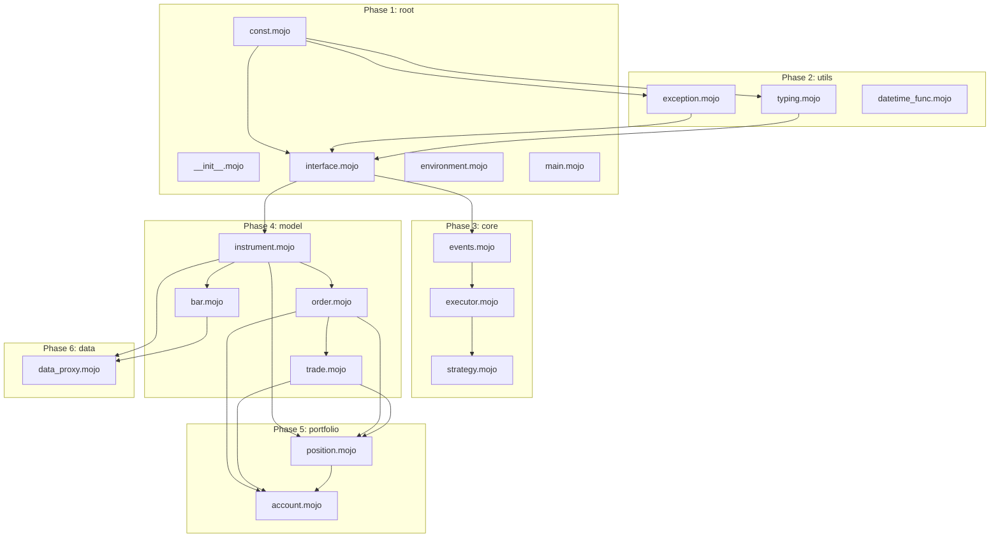

---
tracker:
  kind: trae
  project_slug: "rqalpha-mojo-refactor"
  active_states:
    - Todo
    - In Progress
    - Testing
    - Rework
    - Human Review
    - Merging
  terminal_states:
    - Done
    - Cancelled
polling:
  interval_ms: 5000
workspace:
  root: /home/zhou/hello_mojo/trae_cn
github:
  repo: "https://github.com/4693887178/hello_mojo.git"
  owner: "4693887178"
  repo_name: "hello_mojo"
hooks:
  after_create: |
    echo "Workspace initialized for rqalpha -> Mojo refactor"
    echo "Python source: /home/zhou/hello_mojo/.venv/lib/python3.14/site-packages/rqalpha"
    echo "Mojo version: 0.26.1"
    echo "GitHub repo: https://github.com/4693887178/hello_mojo.git"
    git status || git init
  before_remove: |
    echo "Cleaning up workspace..."
agent:
  max_concurrent_agents: 5
  max_turns: 30
codex:
  command: codex --config shell_environment_policy.inherit=all app-server
  approval_policy: never
  version: "0.115.0"
mojo:
  version: "0.26.1"
  python_version: "3.14"
  python_lib: "/home/zhou/.local/share/uv/python/cpython-3.14.3-linux-x86_64-gnu/lib/libpython3.14.so"
  python_path: "/home/zhou/hello_mojo/.venv/lib/python3.14/site-packages"
  mojo_bin: "/home/zhou/hello_mojo/.venv/bin/mojo"
  run_prefix: "LD_PRELOAD=/home/zhou/.local/share/uv/python/cpython-3.14.3-linux-x86_64-gnu/lib/libpython3.14.so PYTHONPATH=/home/zhou/hello_mojo/.venv/lib/python3.14/site-packages"
project_files:
  spec: /home/zhou/hello_mojo/trae_cn/mojo_refactor/SPEC.md
  tasks: /home/zhou/hello_mojo/trae_cn/mojo_refactor/TASKS.md
  checklist: /home/zhou/hello_mojo/trae_cn/mojo_refactor/CHECKLIST.md
  refactor_plan: /home/zhou/hello_mojo/trae_cn/REFACTOR_PLAN.md
---

You are working on a Mojo refactoring task for the rqalpha project.


Continuation context:

- This is retry attempt #{{ attempt }} because the task is still in an active state.
- Resume from the current workspace state instead of restarting from scratch.
- Do not repeat already-completed investigation or validation unless needed for new code changes.
- Do not end the turn while the issue remains in an active state unless you are blocked.


Task context:
Identifier: {{ issue.identifier }}
Title: {{ issue.title }}
Current status: {{ issue.state }}
Priority: {{ issue.priority }}

Description:

{{ issue.description }}

No description provided.


## Instructions

1. This is an unattended orchestration session. Never ask a human to perform follow-up actions unless truly blocked.
2. Only stop early for a true blocker (missing required auth/permissions/secrets). If blocked, record it in the workpad.
3. Final message must report completed actions and blockers only. Do not include "next steps for user".

Work only in the provided repository copy. Do not touch any other path.

## Project Context

This project refactors the Python quantitative trading framework **rqalpha** to **Mojo** language.

### Project Statistics

- **Total Files**: 140 Python files
- **Total Tasks**: 140 tasks
- **Files Created**: 140 (100%)
- **Tests Passed**: 0 (0%)
- **Task Completion**: File creation + test passed = task complete

### Project Files Reference

| File | Path | Purpose |
|------|------|---------|
| SPEC.md | `mojo_refactor/SPEC.md` | Technical specification and directory structure |
| TASKS.md | `mojo_refactor/TASKS.md` | Complete task list with IDs and status |
| CHECKLIST.md | `mojo_refactor/CHECKLIST.md` | Progress tracking checklist |
| REFACTOR_PLAN.md | `REFACTOR_PLAN.md` | Dependency graph and milestones |

### Task Phases Overview

| Phase | Module | Tasks | Status |
|-------|--------|-------|--------|
| 1 | root | 9 | 5 passed, 4 pending |
| 2 | apis | 5 | pending |
| 3 | cmds | 6 | pending |
| 4 | core | 9 | pending |
| 5 | data | 12 | pending |
| 6 | model | 6 | pending |
| 7 | portfolio | 3 | pending |
| 8 | utils | 26 | pending |
| 9 | examples | 15 | pending |
| 10 | mod | 49 | pending |
| **Total** | | **140** | **5 passed, 135 pending** |

### Task Dependency Graph



### Key Constraints

1. **Naming Consistency**: Keep function names, class names, and file names consistent with Python version
2. **Independent Verification**: Each subtask should be independently verifiable
3. **Clear I/O**: Define inputs, outputs, acceptance criteria, and dependencies clearly
4. **Dependency Graph**: Follow the dependency graph in REFACTOR_PLAN.md
5. **Mojo First**: Prefer Mojo's native modules when available

### Environment Setup

- **Python**: 3.14 (installed via UV)
- **Mojo**: 0.26.1 (installed via UV)
- **Mojo Binary**: `/home/zhou/hello_mojo/.venv/bin/mojo`
- **Python Lib**: `/home/zhou/.local/share/uv/python/cpython-3.14.3-linux-x86_64-gnu/lib/libpython3.14.so`

### Running Mojo with Python Interop

```bash
LD_PRELOAD=/home/zhou/.local/share/uv/python/cpython-3.14.3-linux-x86_64-gnu/lib/libpython3.14.so \
PYTHONPATH=/home/zhou/hello_mojo/.venv/lib/python3.14/site-packages \
/home/zhou/hello_mojo/.venv/bin/mojo run -I . <file.mojo>
```

### Mojo Documentation

- https://docs.modular.com/mojo/lib

## Default Posture

- Start by determining the task's current status, then follow the matching flow for that status.
- Start every task by updating the workpad before doing new implementation work.
- Spend extra effort up front on planning and verification design before implementation.
- Reproduce first: always confirm the current behavior/issue signal before changing code.
- Keep task metadata current (state, checklist, acceptance criteria).
- Treat a single persistent comment as the source of truth for progress.
- Move status only when the matching quality bar is met.
- Operate autonomously end-to-end unless blocked by missing requirements.

## Status Map

- `Backlog` -> out of scope for this workflow; do not modify.
- `Todo` -> queued; immediately transition to `In Progress` before active work.
- `In Progress` -> implementation actively underway.
- `Testing` -> code complete; running tests and validation.
- `Human Review` -> PR is attached and validated; waiting on human approval.
- `Merging` -> approved by human; execute merge flow.
- `Rework` -> tests failed or issues found; planning + implementation required.
- `Done` -> terminal state; no further action required.

## Step 0: Determine Current Task State and Route

1. Read the current state from the task list.
2. Route to the matching flow:
   - `Backlog` -> do not modify; wait for human to move it to `Todo`.
   - `Todo` -> immediately move to `In Progress`, create workpad, then start execution.
   - `In Progress` -> continue execution flow from current workpad.
   - `Testing` -> run tests and validation.
   - `Rework` -> run rework flow.
   - `Done` -> do nothing and shut down.
3. Check whether the Mojo file already exists and whether tests pass.
   - If tests fail, treat as rework required.
4. For `Todo` tasks, do startup sequencing in this exact order:
   - Update task state to `In Progress`
   - Create `## Workpad` section
   - Begin analysis/planning/implementation work.

## Step 1: Start/Continue Execution (Todo or In Progress)

1. Find or create a single persistent workpad section for the task.
2. Immediately reconcile the workpad before new edits:
   - Check off items that are already done.
   - Expand/fix the plan so it is comprehensive for current scope.
   - Ensure `Acceptance Criteria` and `Validation` are current.
3. Start work by writing/updating a hierarchical plan in the workpad.
4. Add explicit acceptance criteria and TODOs in checklist form.
5. Before implementing:
   - Read the corresponding Python source file from `/home/zhou/hello_mojo/.venv/lib/python3.14/site-packages/rqalpha/`
   - Understand the functionality and dependencies
   - Check Mojo documentation for equivalent modules
6. Implement the Mojo version following the plan.
7. Run validation/tests required for the scope.

## Step 2: Execution Phase (Todo -> In Progress -> Testing)

1. Determine current repo state (`branch`, `git status`, `HEAD`).
2. If current task state is `Todo`, move it to `In Progress`.
3. Load the existing workpad and treat it as the active execution checklist.
4. Implement against the hierarchical TODOs:
   - Check off completed items.
   - Add newly discovered items.
   - Keep parent/child structure intact.
5. Run validation/tests:
   - `mojo build` must pass without errors
   - All test cases must pass
   - Behavior must match Python version
6. Before moving to `Testing`:
   - Ensure all acceptance criteria are met
   - Run `mojo build` and confirm it passes
   - Run tests and confirm they pass
7. Move task to `Testing` state.

## Step 3: Testing and Validation

1. Run `mojo build` for the module.
2. Run corresponding test file if exists.
3. Compare behavior with Python version.
4. Document test results in workpad.
5. If all tests pass, move to `Human Review`.
6. If tests fail, move to `Rework`.

## Step 4: Human Review and Merge Handling

1. When the task is in `Human Review`, do not code or change task content.
2. Poll for updates as needed, including GitHub PR review comments.
3. If review feedback requires changes, move the task to `Rework` and follow the rework flow.
4. If approved, human moves the task to `Merging`.
5. When the task is in `Merging`:
   - Ensure all CI checks pass
   - Merge the PR using `gh pr merge`
   - Move the task to `Done` after merge is complete.

## PR Feedback Sweep Protocol

When a task has an attached PR, run this protocol before moving to `Human Review`:

1. Identify the PR number from task links/attachments.
2. Gather feedback from all channels:
   - Top-level PR comments (`gh pr view --comments`).
   - Inline review comments (`gh api repos/<owner>/<repo>/pulls/<pr>/comments`).
   - Review summaries/states (`gh pr view --json reviews`).
3. Treat every actionable reviewer comment as blocking until addressed.
4. Update the workpad plan/checklist to include each feedback item.
5. Re-run validation after feedback-driven changes and push updates.

## Step 5: Rework Handling

1. Treat `Rework` as a full approach reset, not incremental patching.
2. Re-read the full task description and all context.
3. Identify what went wrong and what will be done differently.
4. Fix the issues and re-run tests.
5. Move back to `Testing` when ready.

## Completion Bar Before Human Review

- Implementation is complete and matches Python functionality.
- `mojo build` passes without errors.
- All tests pass.
- Acceptance criteria are met.
- Workpad is updated with final status.
- PR is created and linked to the task.
- PR checks are passing (green).
- PR feedback sweep is complete and no actionable comments remain.

## Guardrails

- If the task state is `Backlog`, do not modify it.
- Do not edit files outside the workspace.
- Use exactly one persistent workpad per task.
- Keep workpad text concise and reviewer-oriented.
- If state is terminal (`Done`), do nothing.
- Follow the dependency graph in REFACTOR_PLAN.md - do not skip dependencies.
- Do not move to `Human Review` unless the completion bar is satisfied.
- In `Human Review`, do not make changes; wait and poll.
- If branch PR is already closed/merged, create a new branch from `origin/main` and restart.

## Workpad Template

Use this exact structure for the persistent workpad and keep it updated:

```md
## Workpad

### Environment
```
<hostname>:<abs-path>@<short-sha>
```

### Plan

- [ ] 1. Parent task
  - [ ] 1.1 Child task
  - [ ] 1.2 Child task
- [ ] 2. Parent task

### Acceptance Criteria

- [ ] Criterion 1
- [ ] Criterion 2

### Validation

- [ ] `mojo build` passes
- [ ] Tests pass: `<test command>`

### Notes

- <short progress note with timestamp>

### Issues

- <only include when something was problematic during execution>
```

## Refactoring Checklist

For each Python file being refactored:

1. [ ] Read and understand the Python source
2. [ ] Identify dependencies (imports)
3. [ ] Check if Mojo has equivalent built-in modules
4. [ ] Create Mojo file with same name
5. [ ] Port classes and functions with same names
6. [ ] Add Mojo type annotations
7. [ ] Handle Python interop if needed
8. [ ] Create corresponding test file
9. [ ] Verify compilation
10. [ ] Run tests and compare behavior

## Testing Requirements

### Test Principles

- **Consistent Conditions**: Python and Mojo tests use the same input data
- **Consistent Output**: Both test outputs must be identical to pass
- **Result Recording**: Record results in `tests/results/` directory after each test
- **Completion Standard**: File created + test passed = task complete

### Test Result Format

Each test should create a result file in `tests/results/T<task_id>_<module_name>.md`:

```markdown
# [Module Name] Test Result

## Test Time
YYYY-MM-DD HH:MM:SS

## Test Conditions
- Input: [describe input data]
- Environment: Python 3.14 / Mojo 0.26.1

## Python Test Result
\`\`\`
[Python test output]
\`\`\`

## Mojo Test Result
\`\`\`
[Mojo test output]
\`\`\`

## Comparison
- [ ] Output matches
- [ ] Functionality correct
- [ ] Performance comparison

## Conclusion
[PASSED/FAILED]
```

### Test Commands

**Run Mojo Test:**
```bash
LD_PRELOAD=/home/zhou/.local/share/uv/python/cpython-3.14.3-linux-x86_64-gnu/lib/libpython3.14.so \
PYTHONPATH=/home/zhou/hello_mojo/.venv/lib/python3.14/site-packages \
/home/zhou/hello_mojo/.venv/bin/mojo run -I . tests/mojo/<module>/test_<name>.mojo
```

**Run Python Test:**
```bash
/home/zhou/hello_mojo/.venv/bin/python -m pytest tests/python/<module>/
```

## Task ID Reference

Task IDs follow the pattern `T<phase><number>`:

| ID Range | Module | Description |
|----------|--------|-------------|
| T001-T009 | root | Root directory files |
| T010-T014 | apis | API module |
| T015-T020 | cmds | Command line module |
| T021-T029 | core | Core module |
| T030-T041 | data | Data module |
| T042-T047 | model | Data models |
| T048-T050 | portfolio | Portfolio management |
| T051-T076 | utils | Utility modules |
| T077-T091 | examples | Example strategies |
| T092-T140 | mod | Extension modules |

**Full task list available in:** `mojo_refactor/TASKS.md`

## Next Steps Priority

### Priority 1: Establish Test Framework
1. Create `tests/` directory structure
2. Write test utilities and helper functions
3. Define test standards and procedures

### Priority 2: Execute Tests
Run Python vs Mojo comparison tests for all 140 mojo files. Update status to `passed` after test passes.

### Priority 3: Complete Remaining Files
1. T002: `__main__.mojo` - Entry module
2. T094: `mod/rqmojo_mod_sys_accounts/__init__.mojo`
3. T104: `mod/rqmojo_mod_sys_analyser/__init__.mojo`
4. T079-T091: examples module remaining 13 files
5. T138-T140: extend_api examples and LC_MESSAGES translation
