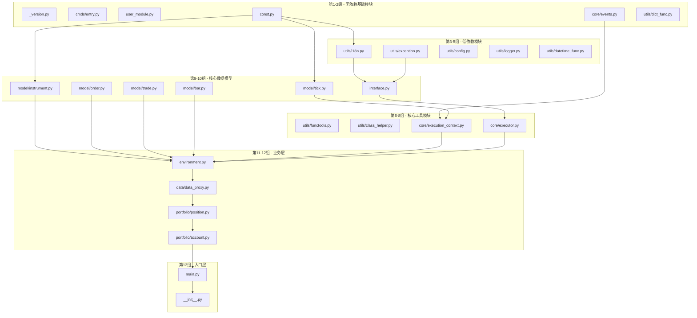

# rqalpha 框架依赖分析报告

> **For agentic workers:** REQUIRED SUB-SKILL: Use superpowers:subagent-driven-development (recommended) or superpowers:executing-plans to implement this plan task-by-task. Steps use checkbox (`- [ ]`) syntax for tracking.

**Goal:** 分析 rqalpha 框架所有 Python 文件的内部依赖关系，按依赖数量从小到大分组，为 Mojo 重构提供指导。

**Architecture:** 通过静态分析每个 .py 文件的 import 语句，筛选出对 rqalpha 内部模块的依赖，按依赖数量分组排序。

**Tech Stack:** Python 3.14, rqalpha 框架, Mojo 0.26.2.0

***

## 文件总数统计

| 类别              | 数量          |
| --------------- | ----------- |
| 总 .py 文件数       | 140         |
| 排除 examples 目录后 | 123         |
| 分组数量            | 13组         |
| 每组文件数           | 10个（最后一组3个） |

***

## 第一组：依赖数量 0（共10个文件）

| 序号 | 文件路径                       | 状态    | 依赖模块 | 人工复盘时间                              |
| -- | -------------------------- | ----- | ---- | ----------------------------------- |
| 1  | `_version.py`              | ✅ 已完成 | 无    | 2026-03-24 00:21                    |
| 2  | `cmds/entry.py`            | ✅ 已完成 | 无    | 2026-04-05 06:58                    |
| 3  | `user_module.py`           | ✅ 已完成 | 无    | 2026-04-05 07:08                    |
| 4  | `utils/click_helper.py`    | ✅ 已完成 | 无    | 2026-04-05 08:04                    |
| 5  | `utils/concurrent.py`      | ✅ 已完成 | 无    | 2026-04-05 08:42                    |
| 6  | `utils/log_capture.py`     | ✅ 已完成 | 无    | 2026-04-05 (重构: handler替换机制+上下文管理器) |
| 7  | `utils/package_helper.py`  | ✅ 已完成 | 无    | 2026-04-05 18:48                    |
| 8  | `utils/persisit_helper.py` | ✅ 已完成 | 无    | 2026-04-05 18:52                    |
| 9  | `utils/repr.py`            | ✅ 已完成 | 无    | 2026-04-05 07:15                    |
| 10 | `utils/typing.py`          | ✅ 已完成 | 无    | 2026-03-24 00:21                    |

***

## 第二组：依赖数量 0-1（共10个文件）

| 序号 | 文件路径                                                    | 状态    | 依赖数量 | 依赖模块                          | 人工复盘时间           |
| -- | ------------------------------------------------------- | ----- | ---- | ----------------------------- | ---------------- |
| 1  | `const.py`                                              | ✅ 已完成 | 0    | 无                             | 2026-03-23 15:30 |
| 2  | `core/__init__.py`                                      | ✅ 已完成 | 0    | 无                             | 2026-03-24 00:26 |
| 3  | `core/events.py`                                        | ✅ 已完成 | 0    | 无                             | 2026-04-05 17:46 |
| 4  | `mod/rqalpha_mod_sys_accounts/api/__init__.py`          | ✅ 已完成 | 0    | 无                             | 2026-04-05 18:05 |
| 5  | `utils/dict_func.py`                                    | ✅ 已完成 | 0    | 无                             | 2026-04-05 18:53 |
| 6  | `utils/risk_free_helper.py`                             | ✅ 已完成 | 0    | 无                             | 2026-04-05 19:21 |
| 7  | `utils/translations/__init__.py`                        | ✅ 已完成 | 0    | 无                             | 2026-04-05 19:47 |
| 8  | `utils/translations/zh_Hans_CN/__init__.py`             | ✅ 已完成 | 0    | 无                             | 2026-04-05 19:48 |
| 9  | `utils/translations/zh_Hans_CN/LC_MESSAGES/__init__.py` | ✅ 已完成 | 0    | 无                             | 2026-04-05 19:50 |
| 10 | `data/base_data_source/adjust.py`                       | ✅ 已完成 | 1    | `rqalpha.utils.datetime_func` | 2026-04-06 00:00 |

***

## 第三组：依赖数量 1-2（共10个文件）

| 序号 | 文件路径                                  | 状态    | 依赖数量 | 依赖模块                                            | 人工复盘时间           |
| -- | ------------------------------------- | ----- | ---- | ----------------------------------------------- | ---------------- |
| 1  | `apis/names.py`                       | ✅ 已完成 | 1    | `rqalpha.const`                                 | 2026-04-06 0046  |
| 2  | `cmds/misc.py`                        | ✅ 已完成 | 1    | `rqalpha.utils.i18n`                            | 2026-04-06 0142  |
| 3  | `core/global_var.py`                  | ✅ 已完成 | 1    | `rqalpha.utils.logger`                          | 2026-04-06 0138  |
| 4  | `data/__init__.py`                    | ✅ 已完成 | 1    | 内部相对导入                                          | 2026-04-06 01:50 |
| 5  | `model/__init__.py`                   | ✅ 已完成 | 1    | 内部相对导入                                          | 2026-04-06 01:54 |
| 6  | `utils/i18n.py`                       | ✅ 已完成 | 1    | `rqalpha.utils.translations`                    | 2026-04-06 0529  |
| 7  | `data/base_data_source/deprecated.py` | ✅ 已完成 | 2    | `rqalpha.const`, `rqalpha.model.instrument`     | 2026-04-06 03:40 |
| 8  | `utils/config.py`                     | ✅ 已完成 | 2    | `rqalpha.utils.i18n`, `rqalpha.utils.logger`    |             |
| 9  | `utils/datetime_func.py`              | ✅ 已完成 | 2    | `rqalpha.utils.i18n`, `rqalpha.utils.exception` |             |
| 10 | `utils/exception.py`                  | ✅ 已完成 | 2    | `rqalpha.utils.i18n`, `rqalpha.const`           | 2026-04-06 05:11 |

***

## 第四组：依赖数量 2（共10个文件）

| 序号 | 文件路径                                       | 状态    | 依赖数量 | 依赖模块                                                                    | 人工复盘时间           |
| -- | ------------------------------------------ | ----- | ---- | ----------------------------------------------------------------------- | ---------------- |
| 1  | `utils/logger.py`                          | ✅ 已完成 | 2    | `rqalpha.utils.i18n`, `rqalpha.utils.config`, `rqalpha.utils.exception` | 2026-04-06 05:44 |
| 2  | `utils/rq_json.py`                         | ✅ 已完成 | 2    | `rqalpha.utils.logger`, `rqalpha.utils.datetime_func`                   |                      |
| 3  | `utils/strategy_loader_help.py`            | ✅ 已完成 | 2    | `rqalpha.utils.logger`, `rqalpha.utils.exception`                       |
| 4  | `utils/testing/__init__.py`                | ✅ 已完成 | 2    | `.mocking`, `.fixtures`                                                 |
| 5  | `utils/arg_checker.py`                     | ✅ 已完成 | 2    | `rqalpha.utils.i18n`                                                    |
| 6  | `utils/class_helper.py`                    | ✅ 已完成 | 2    | `rqalpha.utils.i18n`                                                    |
| 7  | `utils/functools.py`                       | ✅ 已完成 | 2    | `rqalpha.utils.i18n`, `rqalpha.const`                                   |
| 8  | `model/tick.py`                            | ✅ 已完成 | 2    | `rqalpha.utils.i18n`, `rqalpha.utils.repr`                              |
| 9  | `mod/rqalpha_mod_sys_progress/__init__.py` | ✅ 已完成 | 2    | 内部相对导入                                                                  |
| 10 | `mod/rqalpha_mod_sys_progress/mod.py`      | ✅ 已完成 | 2    | `rqalpha.interface`, `rqalpha.utils.logger`                             |

***

## 第五组：依赖数量 2（共10个文件）

| 序号 | 文件路径                                                    | 状态    | 依赖数量 | 依赖模块                                        |
| -- | ------------------------------------------------------- | ----- | ---- | ------------------------------------------- |
| 1  | `mod/rqalpha_mod_sys_transaction_cost/__init__.py`      | ✅ 已完成 | 2    | `rqalpha`, `rqalpha.utils.i18n`             |
| 2  | `mod/rqalpha_mod_sys_transaction_cost/deciders.py`      | ✅ 已完成 | 2    | `rqalpha.const`, `rqalpha.model.instrument` |
| 3  | `mod/rqalpha_mod_sys_transaction_cost/mod.py`           | ✅ 已完成 | 2    | `rqalpha.interface`, `rqalpha.const`        |
| 4  | `mod/rqalpha_mod_sys_scheduler/__init__.py`             | ✅ 已完成 | 2    | 内部相对导入                                      |
| 5  | `mod/rqalpha_mod_sys_simulation/__init__.py`            | ✅ 已完成 | 2    | `rqalpha`, `rqalpha.utils.i18n`             |
| 6  | `mod/rqalpha_mod_sys_analyser/plot/__init__.py`         | ✅ 已完成 | 2    | 内部相对导入                                      |
| 7  | `mod/rqalpha_mod_sys_analyser/plot/consts.py`           | ✅ 已完成 | 2    | 无内部依赖                                       |
| 8  | `mod/rqalpha_mod_sys_analyser/report/__init__.py`       | ✅ 已完成 | 2    | 内部相对导入                                      |
| 9  | `mod/rqalpha_mod_sys_analyser/report/excel_template.py` | ✅ 已完成 | 2    | 内部相对导入                                      |
| 10 | `data/base_data_source/__init__.py`                     | ✅ 已完成 | 2    | 内部相对导入                                      |

***

## 第六组：依赖数量 2-3（共10个文件）

| 序号 | 文件路径                                              | 状态    | 依赖数量 | 依赖模块                                                                    |
| -- | ------------------------------------------------- | ----- | ---- | ----------------------------------------------------------------------- |
| 1  | `mod/rqalpha_mod_sys_risk/__init__.py`            | ✅ 已完成 | 2    | `rqalpha`, `rqalpha.utils.i18n`                                         |
| 2  | `mod/rqalpha_mod_sys_risk/validators/__init__.py` | ✅ 已完成 | 2    | 内部相对导入                                                                  |
| 3  | `mod/rqalpha_mod_sys_accounts/__init__.py`        | ✅ 已完成 | 2    | `rqalpha`, `rqalpha.utils.i18n`                                         |
| 4  | `__main__.py`                                     | ✅ 已完成 | 2    | `rqalpha.cmds`, `rqalpha.mod.utils`                                     |
| 5  | `api.py`                                          | ✅ 已完成 | 3    | `rqalpha.utils`, `rqalpha.utils.exception`, `rqalpha.const`             |
| 6  | `cmds/bundle.py`                                  | ✅ 已完成 | 3    | `rqalpha.utils.i18n`, `rqalpha.cmds.entry`, `rqalpha.utils`             |
| 7  | `cmds/mod.py`                                     | ✅ 已完成 | 3    | `rqalpha.utils.i18n`, `rqalpha.utils.config`, `rqalpha.cmds.entry`      |
| 8  | `core/execution_context.py`                       | ✅ 已完成 | 3    | `rqalpha.const`, `rqalpha.utils.exception`, `rqalpha.utils.i18n`        |
| 9  | `core/executor.py`                                | ✅ 已完成 | 3    | `rqalpha.core.events`, `rqalpha.utils.rq_json`, `rqalpha.utils.logger`  |
| 10 | `core/strategy_loader.py`                         | ✅ 已完成 | 3    | `rqalpha.utils.logger`, `rqalpha.utils.exception`, `rqalpha.utils.i18n` |

***

## 第七组：依赖数量 3-4（共10个文件）

| 序号 | 文件路径                                          | 状态    | 依赖数量 | 依赖模块                                                                      |
| -- | --------------------------------------------- | ----- | ---- | ------------------------------------------------------------------------- |
| 1  | `core/strategy_universe.py`                   | ✅ 已完成 | 3    | `rqalpha.utils.logger`, `rqalpha.core.events`, `rqalpha.model.instrument` |
| 2  | `data/bar_dict_price_board.py`                | ✅ 已完成 | 3    | `rqalpha.interface`, `rqalpha.environment`, `rqalpha.model.bar`           |
| 3  | `mod/rqalpha_mod_sys_analyser/__init__.py`    | ✅ 已完成 | 3    | `rqalpha`, `rqalpha.utils.i18n`                                           |
| 4  | `mod/rqalpha_mod_sys_analyser/plot/utils.py`  | ✅ 已完成 | 3    | 内部相对导入                                                                    |
| 5  | `mod/rqalpha_mod_sys_risk/mod.py`             | ✅ 已完成 | 3    | `rqalpha.interface`, `rqalpha.core.events`, `rqalpha.const`               |
| 6  | `mod/rqalpha_mod_sys_scheduler/mod.py`        | ✅ 已完成 | 3    | `rqalpha.interface`, `rqalpha.core.events`, `rqalpha.utils.logger`        |
| 7  | `mod/rqalpha_mod_sys_simulation/slippage.py`  | ✅ 已完成 | 3    | `rqalpha.const`, `rqalpha.model.order`, `rqalpha.environment`             |
| 8  | `mod/rqalpha_mod_sys_simulation/validator.py` | ✅ 已完成 | 3    | `rqalpha.model.order`, `rqalpha.interface`                                |
| 9  | `mod/utils.py`                                | ✅ 已完成 | 3    | `rqalpha.utils.config`, `rqalpha.mod`, `rqalpha.utils.package_helper`     |
| 10 | `utils/testing/mocking.py`                    | ✅ 已完成 | 3    | `rqalpha.model.instrument`, `rqalpha.model.bar`, `rqalpha.model.tick`     |

***

## 第八组：依赖数量 4（共10个文件）

| 序号 | 文件路径                                                  | 状态    | 依赖数量 | 依赖模块                                                                                             |
| -- | ----------------------------------------------------- | ----- | ---- | ------------------------------------------------------------------------------------------------ |
| 1  | `cmds/run.py`                                         | ✅ 已完成 | 4    | `rqalpha.utils.i18n`, `rqalpha.utils.click_helper`, `rqalpha.utils.config`, `rqalpha.cmds.entry` |
| 2  | `core/strategy_context.py`                            | ✅ 已完成 | 4    | `rqalpha.utils.i18n`, `rqalpha.const`, `rqalpha.core.events`, `rqalpha.utils.logger`             |
| 3  | `data/base_data_source/storage_interface.py`          | ✅ 已完成 | 4    | `rqalpha.model.instrument`, `rqalpha.utils.typing`, `rqalpha.const`, `.deprecated`               |
| 4  | `data/instruments_mixin.py`                           | ✅ 已完成 | 4    | `rqalpha.const`, `rqalpha.model.instrument`, `rqalpha.utils.i18n`, `rqalpha.utils.exception`     |
| 5  | `data/trading_dates_mixin.py`                         | ✅ 已完成 | 4    | `rqalpha.utils.datetime_func`, `rqalpha.utils.i18n`, `rqalpha.const`, `rqalpha.interface`        |
| 6  | `mod/__init__.py`                                     | ✅ 已完成 | 4    | `rqalpha.interface`, `rqalpha.utils.logger`, `rqalpha.utils.i18n`, `rqalpha.utils`               |
| 7  | `mod/rqalpha_mod_sys_accounts/component_validator.py` | ✅ 已完成 | 4    | `rqalpha.const`, `rqalpha.model.instrument`, `rqalpha.utils.i18n`, `rqalpha.utils.exception`     |
| 8  | `mod/rqalpha_mod_sys_accounts/validator.py`           | ✅ 已完成 | 4    | `rqalpha.const`, `rqalpha.model.instrument`, `rqalpha.utils.i18n`, `rqalpha.utils.exception`     |
| 9  | `mod/rqalpha_mod_sys_analyser/mod.py`                 | ✅ 已完成 | 4    | `rqalpha.interface`, `rqalpha.core.events`, `rqalpha.const`, `rqalpha.utils.i18n`                |
| 10 | `mod/rqalpha_mod_sys_analyser/plot_store.py`          | ✅ 已完成 | 4    | `rqalpha.utils.i18n`, `rqalpha.const`, `rqalpha.core.events`, `rqalpha.utils.logger`             |

***

## 第九组：依赖数量 4-5（共10个文件）

| 序号 | 文件路径                                                          | 状态    | 依赖数量 | 依赖模块                                                                                                                                   |
| -- | ------------------------------------------------------------- | ----- | ---- | -------------------------------------------------------------------------------------------------------------------------------------- |
| 1  | `mod/rqalpha_mod_sys_analyser/report/report.py`               | ✅ 已完成 | 4    | `rqalpha.utils.i18n`, `rqalpha.const`, `rqalpha.utils.datetime_func`, `rqalpha.utils.logger`                                           |
| 2  | `mod/rqalpha_mod_sys_risk/validators/price_validator.py`      | ✅ 已完成 | 4    | `rqalpha.const`, `rqalpha.model.instrument`, `rqalpha.utils.i18n`, `rqalpha.utils.exception`                                           |
| 3  | `mod/rqalpha_mod_sys_risk/validators/self_trade_validator.py` | ✅ 已完成 | 4    | `rqalpha.const`, `rqalpha.model.instrument`, `rqalpha.utils.i18n`, `rqalpha.utils.exception`                                           |
| 4  | `mod/rqalpha_mod_sys_scheduler/scheduler.py`                  | ✅ 已完成 | 4    | `rqalpha.utils.i18n`, `rqalpha.const`, `rqalpha.core.events`, `rqalpha.utils.logger`                                                   |
| 5  | `mod/rqalpha_mod_sys_simulation/mod.py`                       | ✅ 已完成 | 4    | `rqalpha.core.events`, `rqalpha.utils.logger`, `rqalpha.interface`, `rqalpha.const`                                                    |
| 6  | `mod/rqalpha_mod_sys_simulation/signal_broker.py`             | ✅ 已完成 | 4    | `rqalpha.interface`, `rqalpha.utils.logger`, `rqalpha.utils.i18n`, `rqalpha.core.events`                                               |
| 7  | `mod/rqalpha_mod_sys_simulation/testing.py`                   | ✅ 已完成 | 4    | `rqalpha.const`, `rqalpha.interface`, `rqalpha.environment`, `rqalpha.model`                                                           |
| 8  | `model/instrument.py`                                         | ✅ 已完成 | 4    | `rqalpha.utils.i18n`, `rqalpha.const`, `rqalpha.utils`, `rqalpha.utils.repr`                                                           |
| 9  | `core/strategy.py`                                            | ✅ 已完成 | 5    | `rqalpha.utils.logger`, `rqalpha.core.events`, `rqalpha.utils.i18n`, `rqalpha.utils.exception`, `rqalpha.const`                        |
| 10 | `data/bundle.py`                                              | ✅ 已完成 | 5    | `rqalpha.apis.api_rqdatac`, `rqalpha.utils.concurrent`, `rqalpha.utils.datetime_func`, `rqalpha.utils.i18n`, `rqalpha.utils.functools` |

***

## 第十组：依赖数量 5-6（共10个文件）

| 序号 | 文件路径                                                        | 状态    | 依赖数量 | 依赖模块                                                                                                                                                                                                                                                             |
| -- | ----------------------------------------------------------- | ----- | ---- | ---------------------------------------------------------------------------------------------------------------------------------------------------------------------------------------------------------------------------------------------------------------- |
| 1  | `interface.py`                                              | ✅ 已完成 | 5    | `rqalpha.const`, `rqalpha.core.events`, `rqalpha.utils.i18n`, `rqalpha.utils.logger`, `rqalpha.utils.typing`                                                                                                                                                     |
| 2  | `mod/rqalpha_mod_sys_accounts/mod.py`                       | ✅ 已完成 | 5    | `rqalpha.interface`, `rqalpha.core.events`, `rqalpha.const`, `rqalpha.utils.i18n`, `rqalpha.utils.logger`                                                                                                                                                        |
| 3  | `mod/rqalpha_mod_sys_accounts/position_validator.py`        | ✅ 已完成 | 5    | `rqalpha.const`, `rqalpha.model.instrument`, `rqalpha.utils.i18n`, `rqalpha.utils.exception`, `rqalpha.utils.logger`                                                                                                                                             |
| 4  | `mod/rqalpha_mod_sys_analyser/plot/plot.py`                 | ✅ 已完成 | 5    | `rqalpha.utils.i18n`, `rqalpha.const`, `rqalpha.utils.datetime_func`, `rqalpha.utils.logger`, `rqalpha.model.bar`                                                                                                                                                |
| 5  | `mod/rqalpha_mod_sys_simulation/matcher.py`                 | ✅ 已完成 | 5    | `rqalpha.const`, `rqalpha.environment`, `rqalpha.core.events`, `rqalpha.model.order`, `rqalpha.model.trade`                                                                                                                                                      |
| 6  | `mod/rqalpha_mod_sys_simulation/simulation_event_source.py` | ✅ 已完成 | 5    | `rqalpha.environment`, `rqalpha.interface`, `rqalpha.core.events`, `rqalpha.utils.exception`, `rqalpha.utils.datetime_func`                                                                                                                                      |
| 7  | `model/order.py`                                            | ✅ 已完成 | 5    | `rqalpha.utils.i18n`, `rqalpha.const`, `rqalpha.utils`, `rqalpha.utils.repr`, `rqalpha.model.instrument`                                                                                                                                                         |
| 8  | `model/trade.py`                                            | ✅ 已完成 | 5    | `rqalpha.utils.i18n`, `rqalpha.const`, `rqalpha.utils`, `rqalpha.utils.repr`, `rqalpha.model.instrument`                                                                                                                                                         |
| 9  | `utils/__init__.py`                                         | ✅ 已完成 | 5    | `rqalpha.utils.exception`, `rqalpha.const`, `rqalpha.utils.datetime_func`, `rqalpha.utils.i18n`, `rqalpha.utils.functools`                                                                                                                                       |
| 10 | `apis/__init__.py`                                          | ✅ 已完成 | 6    | `rqalpha.apis.api_abstract`, `rqalpha.apis.api_base`, `rqalpha.apis.api_rqdatac`, `rqalpha.mod.rqalpha_mod_sys_accounts.api.api_stock`, `rqalpha.mod.rqalpha_mod_sys_accounts.api.api_future`, `rqalpha.mod.rqalpha_mod_sys_accounts.api.order_target_portfolio` |

***

## 第十一组：依赖数量 6（共10个文件）

| 序号 | 文件路径                                                          | 状态    | 依赖数量 | 依赖模块                                                                                                                                                |
| -- | ------------------------------------------------------------- | ----- | ---- | --------------------------------------------------------------------------------------------------------------------------------------------------- |
| 1  | `apis/api_abstract.py`                                        | ✅ 已完成 | 6    | `rqalpha.api`, `rqalpha.core.execution_context`, `rqalpha.const`, `rqalpha.model.instrument`, `rqalpha.model.order`, `rqalpha.utils.arg_checker`    |
| 2  | `cmds/__init__.py`                                            | ✅ 已完成 | 6    | `.bundle`, `.mod`, `.run`, `.misc`, `.entry`, `.run`                                                                                                |
| 3  | `environment.py`                                              | ✅ 已完成 | 6    | `rqalpha.const`, `rqalpha.core.events`, `rqalpha.interface`, `rqalpha.utils.i18n`, `rqalpha.utils.logger`, `rqalpha.utils.exception`                |
| 4  | `mod/rqalpha_mod_sys_risk/validators/cash_validator.py`       | ✅ 已完成 | 6    | `rqalpha.interface`, `rqalpha.const`, `rqalpha.model.order`, `rqalpha.portfolio.account`, `rqalpha.environment`, `rqalpha.utils.i18n`               |
| 5  | `mod/rqalpha_mod_sys_risk/validators/is_trading_validator.py` | ✅ 已完成 | 6    | `rqalpha.interface`, `rqalpha.model.order`, `rqalpha.portfolio.account`, `rqalpha.utils.i18n`, `rqalpha.environment`, `rqalpha.utils.exception`     |
| 6  | `mod/rqalpha_mod_sys_simulation/simulation_broker.py`         | ✅ 已完成 | 6    | `rqalpha.const`, `rqalpha.interface`, `rqalpha.environment`, `rqalpha.model.order`, `rqalpha.model.trade`, `rqalpha.core.events`                    |
| 7  | `mod/rqalpha_mod_sys_accounts/api/order_target_portfolio.py`  | ✅ 已完成 | 6    | `rqalpha.const`, `rqalpha.model.instrument`, `rqalpha.model.order`, `rqalpha.portfolio.account`, `rqalpha.utils.i18n`, `rqalpha.utils.exception`    |
| 8  | `mod/rqalpha_mod_sys_accounts/api/api_future.py`              | ✅ 已完成 | 6    | `rqalpha.const`, `rqalpha.model.instrument`, `rqalpha.model.order`, `rqalpha.portfolio.account`, `rqalpha.utils.i18n`, `rqalpha.utils.exception`    |
| 9  | `model/bar.py`                                                | ✅ 已完成 | 6    | `rqalpha.utils.i18n`, `rqalpha.const`, `rqalpha.utils`, `rqalpha.utils.repr`, `rqalpha.utils.datetime_func`, `rqalpha.model.instrument`             |
| 10 | `data/base_data_source/storages.py`                           | ✅ 已完成 | 6    | `rqalpha.const`, `rqalpha.model.instrument`, `rqalpha.utils.datetime_func`, `rqalpha.utils.i18n`, `rqalpha.utils.functools`, `rqalpha.utils.logger` |

***

## 第十二组：依赖数量 7-9（共10个文件）

| 序号 | 文件路径                                             | 状态    | 依赖数量 | 依赖模块                                                                                                                                                                                                                                                         |
| -- | ------------------------------------------------ | ----- | ---- | ------------------------------------------------------------------------------------------------------------------------------------------------------------------------------------------------------------------------------------------------------------ |
| 1  | `mod/rqalpha_mod_sys_accounts/api/api_stock.py`  | ✅ 已完成 | 7    | `rqalpha.const`, `rqalpha.model.instrument`, `rqalpha.model.order`, `rqalpha.portfolio.account`, `rqalpha.utils.i18n`, `rqalpha.utils.exception`, `rqalpha.utils.logger`                                                                                     |
| 2  | `apis/api_rqdatac.py`                            | ✅ 已完成 | 7    | `rqalpha.const`, `rqalpha.api`, `rqalpha.apis.names`, `rqalpha.core.execution_context`, `rqalpha.environment`, `rqalpha.utils.arg_checker`, `rqalpha.utils.exception`                                                                                        |
| 3  | `mod/rqalpha_mod_sys_accounts/position_model.py` | ✅ 已完成 | 8    | `rqalpha.const`, `rqalpha.model.instrument`, `rqalpha.utils.i18n`, `rqalpha.utils.exception`, `rqalpha.utils.logger`, `rqalpha.environment`, `rqalpha.interface`, `rqalpha.utils`                                                                            |
| 4  | `data/data_proxy.py`                             | ✅ 已完成 | 8    | `rqalpha.const`, `rqalpha.environment`, `rqalpha.core.events`, `rqalpha.interface`, `rqalpha.model.instrument`, `rqalpha.model.tick`, `rqalpha.model.bar`, `rqalpha.utils`                                                                                   |
| 5  | `portfolio/__init__.py`                          | ✅ 已完成 | 8    | `rqalpha.const`, `rqalpha.environment`, `rqalpha.core.events`, `rqalpha.interface`, `rqalpha.model.order`, `rqalpha.portfolio.account`, `rqalpha.data`, `rqalpha.utils`                                                                                      |
| 6  | `portfolio/position.py`                          | ✅ 已完成 | 8    | `rqalpha.const`, `rqalpha.environment`, `rqalpha.core.events`, `rqalpha.interface`, `rqalpha.model.order`, `rqalpha.model.trade`, `rqalpha.utils`, `rqalpha.utils.i18n`                                                                                      |
| 7  | `portfolio/account.py`                           | ✅ 已完成 | 8    | `rqalpha.const`, `rqalpha.environment`, `rqalpha.core.events`, `rqalpha.interface`, `rqalpha.model.order`, `rqalpha.portfolio.position`, `rqalpha.data`, `rqalpha.utils`                                                                                     |
| 8  | `apis/api_base.py`                               | ✅ 已完成 | 9    | `rqalpha.apis.names`, `rqalpha.environment`, `rqalpha.core.execution_context`, `rqalpha.utils`, `rqalpha.utils.exception`, `rqalpha.utils.i18n`, `rqalpha.utils.arg_checker`, `rqalpha.api`, `rqalpha.utils.logger`                                          |
| 9  | `utils/testing/fixtures.py`                      | ✅ 已完成 | 9    | `rqalpha.utils.config`, `rqalpha.environment`, `rqalpha.utils`, `rqalpha.core.strategy_universe`, `rqalpha.data.base_data_source`, `rqalpha.data.bar_dict_price_board`, `rqalpha.data.data_proxy`, `rqalpha.mod.rqalpha_mod_sys_simulation`, `rqalpha.const` |
| 10 | `data/base_data_source/data_source.py`           | ✅ 已完成 | 10   | `rqalpha.const`, `rqalpha.environment`, `rqalpha.core.events`, `rqalpha.interface`, `rqalpha.model.instrument`, `rqalpha.model.tick`, `rqalpha.model.bar`, `rqalpha.utils`, `rqalpha.utils.i18n`, `rqalpha.utils.logger`                                     |

***

## 第十三组：依赖数量 15+（共3个文件）

| 序号 | 文件路径                           | 状态  | 依赖数量 | 依赖模块                                                                                                                                                                                                                                                                                                                                                                                                                                                                                                                 |
| -- | ------------------------------ | --- | ---- | -------------------------------------------------------------------------------------------------------------------------------------------------------------------------------------------------------------------------------------------------------------------------------------------------------------------------------------------------------------------------------------------------------------------------------------------------------------------------------------------------------------------- |
| 1  | `main.py`                      | 待重构 | 15   | `rqalpha.const`, `rqalpha.core.executor`, `rqalpha.core.strategy`, `rqalpha.core.strategy_context`, `rqalpha.core.strategy_loader`, `rqalpha.data.base_data_source`, `rqalpha.data.data_proxy`, `rqalpha.environment`, `rqalpha.core.events`, `rqalpha.core.execution_context`, `rqalpha.interface`, `rqalpha.mod`, `rqalpha.model.bar`, `rqalpha.utils`, `rqalpha.utils.exception`                                                                                                                                  |
| 2  | `__init__.py`                  | 待重构 | 20   | `rqalpha.const`, `rqalpha.utils`, `rqalpha.utils.i18n`, `rqalpha.utils.logger`, `rqalpha.utils.exception`, `rqalpha.utils.config`, `rqalpha.utils.datetime_func`, `rqalpha.utils.functools`, `rqalpha.environment`, `rqalpha.interface`, `rqalpha.core.events`, `rqalpha.core.executor`, `rqalpha.core.strategy_loader`, `rqalpha.core.strategy`, `rqalpha.core.strategy_context`, `rqalpha.core.bar_dict_price_board`, `rqalpha.model.instrument`, `rqalpha.model.order`, `rqalpha.model.bar`, `rqalpha.model.tick` |
| 3  | `utils/testing/integration.py` | 待重构 | 1    | `rqalpha`                                                                                                                                                                                                                                                                                                                                                                                                                                                                                                            |

***

## 统计摘要

| 分组     | 依赖数量范围 | 文件数量    | 已完成     | 待重构    |
| ------ | ------ | ------- | ------- | ------ |
| 第1组    | 0      | 10      | 10      | 0      |
| 第2组    | 0      | 10      | 10      | 0      |
| 第3组    | 1-2    | 10      | 10      | 0      |
| 第4组    | 2      | 10      | 10      | 0      |
| 第5组    | 2      | 10      | 10      | 0      |
| 第6组    | 2-3    | 10      | 10      | 0      |
| 第7组    | 3-4    | 10      | 10      | 0      |
| 第8组    | 4      | 10      | 0       | 10     |
| 第9组    | 4-5    | 10      | 0       | 10     |
| 第10组   | 5-6    | 10      | 10      | 0      |
| 第11组   | 6      | 10      | 10      | 0      |
| 第12组   | 7-10   | 10      | 10      | 0      |
| 第13组   | 1-20   | 3       | 0       | 3      |
| **总计** | -      | **123** | **100** | **23** |

***

## 依赖关系图（Mermaid）

***

## 重构建议

### 推荐重构顺序

1. **第1-2组**：基础模块（已完成大部分）
2. **第3-5组**：低依赖工具模块
3. **第6-8组**：核心工具和执行上下文
4. **第9-10组**：核心数据模型
5. **第11-12组**：数据层、投资组合、环境
6. **第13组**：主入口（最后重构）

### 注意事项

- 每组重构完成后需要进行单元测试验证
- 优先使用 Mojo 标准库中的模块
- 保持函数名、类名、方法名与 Python 版本一致
- 注意 Mojo 0.26+ 使用 `def` 而非 `fn` 定义函数

