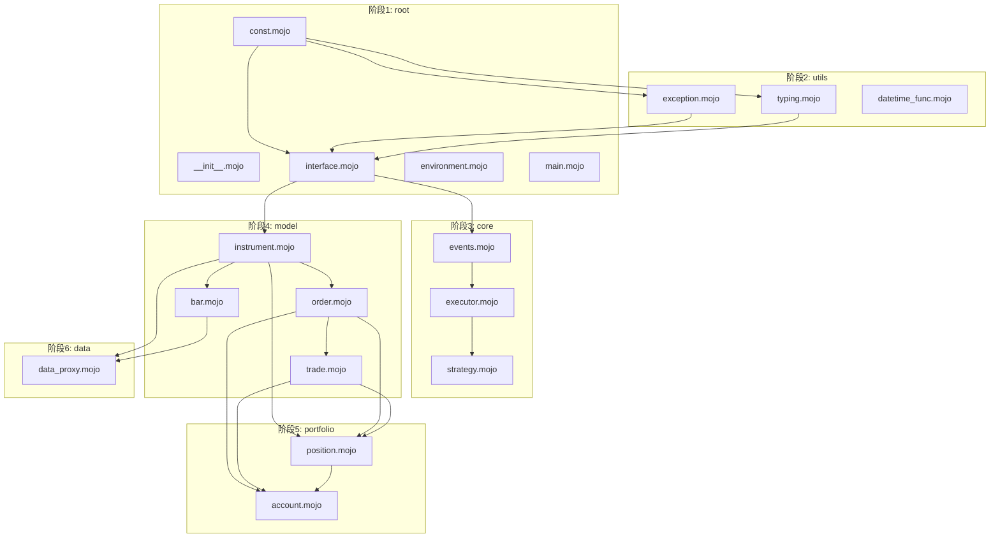

# RQAlpha Mojo 重构完整任务列表

## 统计信息

- **总文件数**: 140 个 Python 文件
- **总任务数**: 140 个任务
- **每完成一个文件并测试通过算一个任务**

## 任务分类统计

| 目录        | 文件数     | 说明     |
| --------- | ------- | ------ |
| root      | 9       | 根目录文件  |
| apis      | 5       | API 模块 |
| cmds      | 6       | 命令行模块  |
| core      | 8       | 核心模块   |
| data      | 9       | 数据模块   |
| examples  | 15      | 示例策略   |
| model     | 6       | 数据模型   |
| portfolio | 3       | 组合管理   |
| utils     | 26      | 工具模块   |
| mod       | 53      | 扩展模块   |
| **总计**    | **140** |   |

## 阶段 1: 根目录文件 (9个任务)

| ID   | 源文件                     | 目标文件                     | 状态      |
| ---- | ----------------------- | ------------------------ | ------- |
| T001 | rqalpha/__init__.py     | rqmojo/__init__.mojo     | passed  |
| T002 | rqalpha/__main__.py     | rqmojo/__main__.mojo     | passed  |
| T003 | rqalpha/\_version.py    | rqmojo/\_version.mojo    | passed  |
| T004 | rqalpha/api.py          | rqmojo/api.mojo          | passed  |
| T005 | rqalpha/const.py        | rqmojo/const.mojo        | passed  |
| T006 | rqalpha/environment.py  | rqmojo/environment.mojo  | pending |
| T007 | rqalpha/interface.py    | rqmojo/interface.mojo    | pending |
| T008 | rqalpha/main.py         | rqmojo/main.mojo         | pending |
| T009 | rqalpha/user\_module.py | rqmojo/user\_module.mojo | pending |

## 阶段 2: apis 模块 (5个任务)

| ID   | 源文件                           | 目标文件                           | 状态      |
| ---- | ----------------------------- | ------------------------------ | ------- |
| T010 | rqalpha/apis/__init__.py      | rqmojo/apis/__init__.mojo      | pending |
| T011 | rqalpha/apis/api\_abstract.py | rqmojo/apis/api\_abstract.mojo | pending |
| T012 | rqalpha/apis/api\_base.py     | rqmojo/apis/api\_base.mojo     | pending |
| T013 | rqalpha/apis/api\_rqdatac.py  | rqmojo/apis/api\_rqdatac.mojo  | pending |
| T014 | rqalpha/apis/names.py         | rqmojo/apis/names.mojo         | pending |

## 阶段 3: cmds 模块 (6个任务)

| ID   | 源文件                      | 目标文件                      | 状态      |
| ---- | ------------------------ | ------------------------- | ------- |
| T015 | rqalpha/cmds/__init__.py | rqmojo/cmds/__init__.mojo | pending |
| T016 | rqalpha/cmds/bundle.py   | rqmojo/cmds/bundle.mojo   | pending |
| T017 | rqalpha/cmds/entry.py    | rqmojo/cmds/entry.mojo    | pending |
| T018 | rqalpha/cmds/misc.py     | rqmojo/cmds/misc.mojo     | pending |
| T019 | rqalpha/cmds/mod.py      | rqmojo/cmds/mod.mojo      | pending |
| T020 | rqalpha/cmds/run.py      | rqmojo/cmds/run.mojo      | pending |

## 阶段 4: core 模块 (8个任务)

| ID   | 源文件                                | 目标文件                                | 状态      |
| ---- | ---------------------------------- | ----------------------------------- | ------- |
| T021 | rqalpha/core/__init__.py           | rqmojo/core/__init__.mojo           | pending |
| T022 | rqalpha/core/events.py             | rqmojo/core/events.mojo             | pending |
| T023 | rqalpha/core/execution\_context.py | rqmojo/core/execution\_context.mojo | pending |
| T024 | rqalpha/core/executor.py           | rqmojo/core/executor.mojo           | pending |
| T025 | rqalpha/core/global\_var.py        | rqmojo/core/global\_var.mojo        | pending |
| T026 | rqalpha/core/strategy.py           | rqmojo/core/strategy.mojo           | pending |
| T027 | rqalpha/core/strategy\_context.py  | rqmojo/core/strategy\_context.mojo  | pending |
| T028 | rqalpha/core/strategy\_loader.py   | rqmojo/core/strategy\_loader.mojo   | pending |
| T029 | rqalpha/core/strategy\_universe.py | rqmojo/core/strategy\_universe.mojo | pending |

## 阶段 5: data 模块 (9个任务)

| ID   | 源文件                                                   | 目标文件                                                   | 状态      |
| ---- | ----------------------------------------------------- | ------------------------------------------------------ | ------- |
| T030 | rqalpha/data/__init__.py                              | rqmojo/data/__init__.mojo                              | pending |
| T031 | rqalpha/data/bar\_dict\_price\_board.py               | rqmojo/data/bar\_dict\_price\_board.mojo               | pending |
| T032 | rqalpha/data/bundle.py                                | rqmojo/data/bundle.mojo                                | pending |
| T033 | rqalpha/data/data\_proxy.py                           | rqmojo/data/data\_proxy.mojo                           | pending |
| T034 | rqalpha/data/instruments\_mixin.py                    | rqmojo/data/instruments\_mixin.mojo                    | pending |
| T035 | rqalpha/data/trading\_dates\_mixin.py                 | rqmojo/data/trading\_dates\_mixin.mojo                 | pending |
| T036 | rqalpha/data/base\_data\_source/__init__.py           | rqmojo/data/base\_data\_source/__init__.mojo           | pending |
| T037 | rqalpha/data/base\_data\_source/adjust.py             | rqmojo/data/base\_data\_source/adjust.mojo             | pending |
| T038 | rqalpha/data/base\_data\_source/data\_source.py       | rqmojo/data/base\_data\_source/data\_source.mojo       | pending |
| T039 | rqalpha/data/base\_data\_source/deprecated.py         | rqmojo/data/base\_data\_source/deprecated.mojo         | pending |
| T040 | rqalpha/data/base\_data\_source/storage\_interface.py | rqmojo/data/base\_data\_source/storage\_interface.mojo | pending |
| T041 | rqalpha/data/base\_data\_source/storages.py           | rqmojo/data/base\_data\_source/storages.mojo           | pending |

## 阶段 6: model 模块 (6个任务)

| ID   | 源文件                         | 目标文件                         | 状态      |
| ---- | --------------------------- | ---------------------------- | ------- |
| T042 | rqalpha/model/__init__.py   | rqmojo/model/__init__.mojo   | pending |
| T043 | rqalpha/model/bar.py        | rqmojo/model/bar.mojo        | pending |
| T044 | rqalpha/model/instrument.py | rqmojo/model/instrument.mojo | pending |
| T045 | rqalpha/model/order.py      | rqmojo/model/order.mojo      | pending |
| T046 | rqalpha/model/tick.py       | rqmojo/model/tick.mojo       | pending |
| T047 | rqalpha/model/trade.py      | rqmojo/model/trade.mojo      | pending |

## 阶段 7: portfolio 模块 (3个任务)

| ID   | 源文件                           | 目标文件                           | 状态      |
| ---- | ----------------------------- | ------------------------------ | ------- |
| T048 | rqalpha/portfolio/__init__.py | rqmojo/portfolio/__init__.mojo | pending |
| T049 | rqalpha/portfolio/account.py  | rqmojo/portfolio/account.mojo  | pending |
| T050 | rqalpha/portfolio/position.py | rqmojo/portfolio/position.mojo | pending |

## 阶段 8: utils 模块 (26个任务)

| ID   | 源文件                                                 | 目标文件                                                 | 状态      |
| ---- | --------------------------------------------------- | ---------------------------------------------------- | ------- |
| T051 | rqalpha/utils/__init__.py                           | rqmojo/utils/__init__.mojo                           | pending |
| T052 | rqalpha/utils/arg\_checker.py                       | rqmojo/utils/arg\_checker.mojo                       | pending |
| T053 | rqalpha/utils/class\_helper.py                      | rqmojo/utils/class\_helper.mojo                      | pending |
| T054 | rqalpha/utils/click\_helper.py                      | rqmojo/utils/click\_helper.mojo                      | pending |
| T055 | rqalpha/utils/concurrent.py                         | rqmojo/utils/concurrent.mojo                         | pending |
| T056 | rqalpha/utils/config.py                             | rqmojo/utils/config.mojo                             | pending |
| T057 | rqalpha/utils/datetime\_func.py                     | rqmojo/utils/datetime\_func.mojo                     | pending |
| T058 | rqalpha/utils/dict\_func.py                         | rqmojo/utils/dict\_func.mojo                         | pending |
| T059 | rqalpha/utils/exception.py                          | rqmojo/utils/exception.mojo                          | pending |
| T060 | rqalpha/utils/functools.py                          | rqmojo/utils/functools.mojo                          | pending |
| T061 | rqalpha/utils/i18n.py                               | rqmojo/utils/i18n.mojo                               | pending |
| T062 | rqalpha/utils/log\_capture.py                       | rqmojo/utils/log\_capture.mojo                       | pending |
| T063 | rqalpha/utils/logger.py                             | rqmojo/utils/logger.mojo                             | pending |
| T064 | rqalpha/utils/package\_helper.py                    | rqmojo/utils/package\_helper.mojo                    | pending |
| T065 | rqalpha/utils/persisit\_helper.py                   | rqmojo/utils/persisit\_helper.mojo                   | pending |
| T066 | rqalpha/utils/repr.py                               | rqmojo/utils/repr.mojo                               | pending |
| T067 | rqalpha/utils/risk\_free\_helper.py                 | rqmojo/utils/risk\_free\_helper.mojo                 | pending |
| T068 | rqalpha/utils/rq\_json.py                           | rqmojo/utils/rq\_json.mojo                           | pending |
| T069 | rqalpha/utils/strategy\_loader\_help.py             | rqmojo/utils/strategy\_loader\_help.mojo             | pending |
| T070 | rqalpha/utils/typing.py                             | rqmojo/utils/typing.mojo                             | pending |
| T071 | rqalpha/utils/testing/__init__.py                   | rqmojo/utils/testing/__init__.mojo                   | pending |
| T072 | rqalpha/utils/testing/fixtures.py                   | rqmojo/utils/testing/fixtures.mojo                   | pending |
| T073 | rqalpha/utils/testing/integration.py                | rqmojo/utils/testing/integration.mojo                | pending |
| T074 | rqalpha/utils/testing/mocking.py                    | rqmojo/utils/testing/mocking.mojo                    | pending |
| T075 | rqalpha/utils/translations/__init__.py              | rqmojo/utils/translations/__init__.mojo              | pending |
| T076 | rqalpha/utils/translations/zh\_Hans\_CN/__init__.py | rqmojo/utils/translations/zh\_Hans\_CN/__init__.mojo | pending |

## 阶段 9: examples 模块 (15个任务)

| ID   | 源文件                                                       | 目标文件                                                       | 状态      |
| ---- | --------------------------------------------------------- | ---------------------------------------------------------- | ------- |
| T077 | rqalpha/examples/buy\_and\_hold.py                        | rqmojo/examples/buy\_and\_hold.mojo                        | pending |
| T078 | rqalpha/examples/golden\_cross.py                         | rqmojo/examples/golden\_cross.mojo                         | pending |
| T079 | rqalpha/examples/IF\_macd.py                              | rqmojo/examples/IF\_macd.mojo                              | pending |
| T080 | rqalpha/examples/macd.py                                  | rqmojo/examples/macd.mojo                                  | pending |
| T081 | rqalpha/examples/pair\_trading.py                         | rqmojo/examples/pair\_trading.mojo                         | pending |
| T082 | rqalpha/examples/rsi.py                                   | rqmojo/examples/rsi.mojo                                   | pending |
| T083 | rqalpha/examples/run\_code\_demo.py                       | rqmojo/examples/run\_code\_demo.mojo                       | pending |
| T084 | rqalpha/examples/run\_file\_demo.py                       | rqmojo/examples/run\_file\_demo.mojo                       | pending |
| T085 | rqalpha/examples/run\_func\_demo.py                       | rqmojo/examples/run\_func\_demo.mojo                       | pending |
| T086 | rqalpha/examples/subscribe\_event.py                      | rqmojo/examples/subscribe\_event.mojo                      | pending |
| T087 | rqalpha/examples/test\_pt.py                              | rqmojo/examples/test\_pt.mojo                              | pending |
| T088 | rqalpha/examples/turtle.py                                | rqmojo/examples/turtle.mojo                                | pending |
| T089 | rqalpha/examples/data\_source/get\_csv\_module.py         | rqmojo/examples/data\_source/get\_csv\_module.mojo         | pending |
| T090 | rqalpha/examples/data\_source/import\_get\_csv\_module.py | rqmojo/examples/data\_source/import\_get\_csv\_module.mojo | pending |
| T091 | rqalpha/examples/data\_source/read\_csv\_as\_df.py        | rqmojo/examples/data\_source/read\_csv\_as\_df.mojo        | pending |

## 阶段 10: mod 模块 (49个任务)

| ID   | 源文件                                                                      | 目标文件                                                                      | 状态      |
| ---- | ------------------------------------------------------------------------ | ------------------------------------------------------------------------- | ------- |
| T092 | rqalpha/mod/__init__.py                                                  | rqmojo/mod/__init__.mojo                                                  | pending |
| T093 | rqalpha/mod/utils.py                                                     | rqmojo/mod/utils.mojo                                                     | pending |
| T094 | rqalpha/mod/rqalpha\_mod\_sys\_accounts/__init__.py                      | rqmojo/mod/rqalpha\_mod\_sys\_accounts/__init__.mojo                      | pending |
| T095 | rqalpha/mod/rqalpha\_mod\_sys\_accounts/mod.py                           | rqmojo/mod/rqalpha\_mod\_sys\_accounts/mod.mojo                           | pending |
| T096 | rqalpha/mod/rqalpha\_mod\_sys\_accounts/component\_validator.py          | rqmojo/mod/rqalpha\_mod\_sys\_accounts/component\_validator.mojo          | pending |
| T097 | rqalpha/mod/rqalpha\_mod\_sys\_accounts/position\_model.py               | rqmojo/mod/rqalpha\_mod\_sys\_accounts/position\_model.mojo               | pending |
| T098 | rqalpha/mod/rqalpha\_mod\_sys\_accounts/position\_validator.py           | rqmojo/mod/rqalpha\_mod\_sys\_accounts/position\_validator.mojo           | pending |
| T099 | rqalpha/mod/rqalpha\_mod\_sys\_accounts/validator.py                     | rqmojo/mod/rqalpha\_mod\_sys\_accounts/validator.mojo                     | pending |
| T100 | rqalpha/mod/rqalpha\_mod\_sys\_accounts/api/__init__.py                  | rqmojo/mod/rqalpha\_mod\_sys\_accounts/api/__init__.mojo                  | pending |
| T101 | rqalpha/mod/rqalpha\_mod\_sys\_accounts/api/api\_future.py               | rqmojo/mod/rqalpha\_mod\_sys\_accounts/api/api\_future.mojo               | pending |
| T102 | rqalpha/mod/rqalpha\_mod\_sys\_accounts/api/api\_stock.py                | rqmojo/mod/rqalpha\_mod\_sys\_accounts/api/api\_stock.mojo                | pending |
| T103 | rqalpha/mod/rqalpha\_mod\_sys\_accounts/api/order\_target\_portfolio.py  | rqmojo/mod/rqalpha\_mod\_sys\_accounts/api/order\_target\_portfolio.mojo  | pending |
| T104 | rqalpha/mod/rqalpha\_mod\_sys\_analyser/__init__.py                      | rqmojo/mod/rqalpha\_mod\_sys\_analyser/__init__.mojo                      | pending |
| T105 | rqalpha/mod/rqalpha\_mod\_sys\_analyser/mod.py                           | rqmojo/mod/rqalpha\_mod\_sys\_analyser/mod.mojo                           | pending |
| T106 | rqalpha/mod/rqalpha\_mod\_sys\_analyser/plot\_store.py                   | rqmojo/mod/rqalpha\_mod\_sys\_analyser/plot\_store.mojo                   | pending |
| T107 | rqalpha/mod/rqalpha\_mod\_sys\_analyser/plot/__init__.py                 | rqmojo/mod/rqalpha\_mod\_sys\_analyser/plot/__init__.mojo                 | pending |
| T108 | rqalpha/mod/rqalpha\_mod\_sys\_analyser/plot/consts.py                   | rqmojo/mod/rqalpha\_mod\_sys\_analyser/plot/consts.mojo                   | pending |
| T109 | rqalpha/mod/rqalpha\_mod\_sys\_analyser/plot/plot.py                     | rqmojo/mod/rqalpha\_mod\_sys\_analyser/plot/plot.mojo                     | pending |
| T110 | rqalpha/mod/rqalpha\_mod\_sys\_analyser/plot/utils.py                    | rqmojo/mod/rqalpha\_mod\_sys\_analyser/plot/utils.mojo                    | pending |
| T111 | rqalpha/mod/rqalpha\_mod\_sys\_analyser/report/__init__.py               | rqmojo/mod/rqalpha\_mod\_sys\_analyser/report/__init__.mojo               | pending |
| T112 | rqalpha/mod/rqalpha\_mod\_sys\_analyser/report/excel\_template.py        | rqmojo/mod/rqalpha\_mod\_sys\_analyser/report/excel\_template.mojo        | pending |
| T113 | rqalpha/mod/rqalpha\_mod\_sys\_analyser/report/report.py                 | rqmojo/mod/rqalpha\_mod\_sys\_analyser/report/report.mojo                 | pending |
| T114 | rqalpha/mod/rqalpha\_mod\_sys\_progress/__init__.py                      | rqmojo/mod/rqalpha\_mod\_sys\_progress/__init__.mojo                      | pending |
| T115 | rqalpha/mod/rqalpha\_mod\_sys\_progress/mod.py                           | rqmojo/mod/rqalpha\_mod\_sys\_progress/mod.mojo                           | pending |
| T116 | rqalpha/mod/rqalpha\_mod\_sys\_risk/__init__.py                          | rqmojo/mod/rqalpha\_mod\_sys\_risk/__init__.mojo                          | pending |
| T117 | rqalpha/mod/rqalpha\_mod\_sys\_risk/mod.py                               | rqmojo/mod/rqalpha\_mod\_sys\_risk/mod.mojo                               | pending |
| T118 | rqalpha/mod/rqalpha\_mod\_sys\_risk/validators/__init__.py               | rqmojo/mod/rqalpha\_mod\_sys\_risk/validators/__init__.mojo               | pending |
| T119 | rqalpha/mod/rqalpha\_mod\_sys\_risk/validators/cash\_validator.py        | rqmojo/mod/rqalpha\_mod\_sys\_risk/validators/cash\_validator.mojo        | pending |
| T120 | rqalpha/mod/rqalpha\_mod\_sys\_risk/validators/is\_trading\_validator.py | rqmojo/mod/rqalpha\_mod\_sys\_risk/validators/is\_trading\_validator.mojo | pending |
| T121 | rqalpha/mod/rqalpha\_mod\_sys\_risk/validators/price\_validator.py       | rqmojo/mod/rqalpha\_mod\_sys\_risk/validators/price\_validator.mojo       | pending |
| T122 | rqalpha/mod/rqalpha\_mod\_sys\_risk/validators/self\_trade\_validator.py | rqmojo/mod/rqalpha\_mod\_sys\_risk/validators/self\_trade\_validator.mojo | pending |
| T123 | rqalpha/mod/rqalpha\_mod\_sys\_scheduler/__init__.py                     | rqmojo/mod/rqalpha\_mod\_sys\_scheduler/__init__.mojo                     | pending |
| T124 | rqalpha/mod/rqalpha\_mod\_sys\_scheduler/mod.py                          | rqmojo/mod/rqalpha\_mod\_sys\_scheduler/mod.mojo                          | pending |
| T125 | rqalpha/mod/rqalpha\_mod\_sys\_scheduler/scheduler.py                    | rqmojo/mod/rqalpha\_mod\_sys\_scheduler/scheduler.mojo                    | pending |
| T126 | rqalpha/mod/rqalpha\_mod\_sys\_simulation/__init__.py                    | rqmojo/mod/rqalpha\_mod\_sys\_simulation/__init__.mojo                    | pending |
| T127 | rqalpha/mod/rqalpha\_mod\_sys\_simulation/matcher.py                     | rqmojo/mod/rqalpha\_mod\_sys\_simulation/matcher.mojo                     | pending |
| T128 | rqalpha/mod/rqalpha\_mod\_sys\_simulation/mod.py                         | rqmojo/mod/rqalpha\_mod\_sys\_simulation/mod.mojo                         | pending |
| T129 | rqalpha/mod/rqalpha\_mod\_sys\_simulation/signal\_broker.py              | rqmojo/mod/rqalpha\_mod\_sys\_simulation/signal\_broker.mojo              | pending |
| T130 | rqalpha/mod/rqalpha\_mod\_sys\_simulation/simulation\_broker.py          | rqmojo/mod/rqalpha\_mod\_sys\_simulation/simulation\_broker.mojo          | pending |
| T131 | rqalpha/mod/rqalpha\_mod\_sys\_simulation/simulation\_event\_source.py   | rqmojo/mod/rqalpha\_mod\_sys\_simulation/simulation\_event\_source.mojo   | pending |
| T132 | rqalpha/mod/rqalpha\_mod\_sys\_simulation/slippage.py                    | rqmojo/mod/rqalpha\_mod\_sys\_simulation/slippage.mojo                    | pending |
| T133 | rqalpha/mod/rqalpha\_mod\_sys\_simulation/testing.py                     | rqmojo/mod/rqalpha\_mod\_sys\_simulation/testing.mojo                     | pending |
| T134 | rqalpha/mod/rqalpha\_mod\_sys\_simulation/validator.py                   | rqmojo/mod/rqalpha\_mod\_sys\_simulation/validator.mojo                   | pending |
| T135 | rqalpha/mod/rqalpha\_mod\_sys\_transaction\_cost/__init__.py             | rqmojo/mod/rqalpha\_mod\_sys\_transaction\_cost/__init__.mojo             | pending |
| T136 | rqalpha/mod/rqalpha\_mod\_sys\_transaction\_cost/deciders.py             | rqmojo/mod/rqalpha\_mod\_sys\_transaction\_cost/deciders.mojo             | pending |
| T137 | rqalpha/mod/rqalpha\_mod\_sys\_transaction\_cost/mod.py                  | rqmojo/mod/rqalpha\_mod\_sys\_transaction\_cost/mod.mojo                  | pending |
| T138 | rqalpha/examples/extend\_api/rqalpha\_mod\_extend\_api\_demo.py          | rqmojo/examples/extend\_api/rqalpha\_mod\_extend\_api\_demo.mojo          | pending |
| T139 | rqalpha/examples/extend\_api/test\_extend\_api.py                        | rqmojo/examples/extend\_api/test\_extend\_api.mojo                        | pending |
| T140 | rqalpha/utils/translations/zh\_Hans\_CN/LC\_MESSAGES/__init__.py         | rqmojo/utils/translations/zh\_Hans\_CN/LC\_MESSAGES/__init__.mojo         | pending |

## 总体进度

| 阶段             | 任务数     | 完成    | 进度     |
| -------------- | ------- | ----- | ------ |
| 阶段1: root      | 9       | 0     | 0%     |
| 阶段2: apis      | 5       | 0     | 0%     |
| 阶段3: cmds      | 6       | 0     | 0%     |
| 阶段4: core      | 9       | 0     | 0%     |
| 阶段5: data      | 12      | 0     | 0%     |
| 阶段6: model     | 6       | 0     | 0%     |
| 阶段7: portfolio | 3       | 0     | 0%     |
| 阶段8: utils     | 26      | 0     | 0%     |
| 阶段9: examples  | 15      | 0     | 0%     |
| 阶段10: mod      | 49      | 0     | 0%     |
| **总计**         | **140** | **0** | **0%** |

## 任务依赖图

