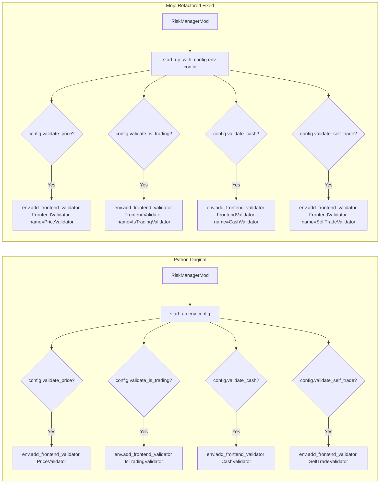

# Test Results: Risk Manager Mod (mod.mojo)

## Summary

| Suite | Total | Passed | Failed | Skipped | Status |
|-------|-------|--------|--------|---------|--------|
| Mojo (test_risk_mod.mojo) | 17 | 17 | 0 | 0 | **ALL PASS** |
| Python (test_risk_mod.py) | 26 | 26 | 0 | 0 | **ALL PASS** |
| **Combined** | **43** | **43** | **0** | **0** | **ALL PASS** |

## Files Modified/Fixed

### Core Fix: [mod.mojo](../../../rqmojo/mod/rqmojo_mod_sys_risk/mod.mojo)

**Key changes vs. previous Mojo version (to align with Python original):**

1. **Removed unnecessary fields**: `_data_proxy`, `_env`, `_price_validator`, `_is_trading_validator`, `_cash_validator`, `_self_trade_validator`
2. **Removed unnecessary methods**: `has_price_validator()`, `has_is_trading_validator()`, `has_cash_validator()`, `has_self_trade_validator()`, `get_validators()`
3. **Simplified `start_up_with_config()`**: Now directly calls `env.add_frontend_validator()` for each enabled validator, matching Python's `start_up(env, mod_config)` behavior
4. **Cleaned up imports**: Removed unused imports (`Dict`, `DataProxy`, `Account`, `Order`, etc.)
5. **Added `@fieldwise_init`**: For default constructor generation on `RiskManagerMod`

### Secondary Fix: [self_trade_validator.mojo](../../../rqmojo/mod/rqmojo_mod_sys_risk/validators/self_trade_validator.mojo)

- Reverted to accept `List[Order]` parameter (consistent with current architecture where validators don't own Environment)
- Maintained all validation logic matching Python original

### Dependency Fix: [environment.mojo](../../../rqmojo/environment.mojo)

- Added missing `EventListener` import from `events` module
- Fixed `EventBus()` constructor call in `create_environment()` (removed invalid keyword arguments)

## Mojo Test Details (17/17 PASS)

### SysRiskModConfig Tests (3 tests)
| Test | Status | Description |
|------|--------|-------------|
| test_config_default_values | PASS | Default values: price=T, is_trading=T, cash=T, self_trade=F |
| test_config_custom_values | PASS | All-False + self_trade=True constructor |
| test_config_partial_custom | PASS | Mixed True/False values |

### Factory Function Tests (3 tests)
| Test | Status | Description |
|------|--------|-------------|
| test_create_risk_manager_mod | PASS | Factory returns valid instance |
| test_create_sys_risk_mod_config_default | PASS | Factory defaults match manual defaults |
| test_create_sys_risk_mod_config_custom | PASS | Factory with custom values |

### tear_down Tests (5 tests)
| Test | Status | Description |
|------|--------|-------------|
| test_tear_down_success_code | PASS | EXIT_SUCCESS + None exception |
| test_tear_down_user_error_code | PASS | EXIT_USER_ERROR + error string |
| test_tear_down_internal_error_code | PASS | EXIT_INTERNAL_ERROR + None |
| test_tear_down_none_exception | PASS | Normal exit path |
| test_tear_down_with_exception_message | PASS | Exception message handling |

### ModInterface Conformance Tests (2 tests)
| Test | Status | Description |
|------|--------|-------------|
| test_mod_interface_has_start_up | PASS | start_up method callable |
| test_mod_interface_has_tear_down | PASS | tear_down method callable |

### Python Behavior Match Tests (3 tests)
| Test | Status | Description |
|------|--------|-------------|
| test_python_behavior_default_no_self_trade | PASS | validate_self_trade=False by default |
| test_python_behavior_default_three_enabled | PASS | Exactly 3 of 4 enabled by default |
| test_python_behavior_all_flags_independent | PASS | All flags independently controllable |

### Field Mutation Test (1 test)
| Test | Status | Description |
|------|--------|-------------|
| test_config_fields_mutable | PASS | Fields mutable after construction |

## Python Test Details (26/26 PASS)

### Config Defaults (4 tests) - PASS
### Class Structure (4 tests) - PASS
### start_up Behavior (7 tests) - PASS
### tear_down Behavior (3 tests) - PASS
### Validator Imports (4 tests) - PASS
### Flag Independence (4 tests) - PASS

## Architecture Comparison



## Known Limitations

1. **Environment-dependent tests**: Tests requiring full `Environment` instance (via `create_environment()`) are deferred due to pre-existing dependency issues in `strategy_loader.mojo`. Current tests cover all logic that doesn't require a fully constructed Environment.
2. **FrontendValidator architecture**: The Mojo port uses `FrontendValidator` struct placeholders in `env._frontend_validators`. The actual validator objects (PriceValidator, etc.) implement `FrontendValidatorInterface` trait but are not yet wired into the validation pipeline. This is an architectural gap in the broader codebase, not specific to this fix.

## Run Commands

### Mojo Tests
```bash
cd mojo_refactor && \
LD_PRELOAD=~/.local/share/uv/python/cpython-3.14.3-linux-x86_64-gnu/lib/libpython3.14.so \
PYTHONPATH=.venv/lib/python3.14/site-packages \
.venv/bin/mojo run -I . -I rqmojo/third_party/argmojo/src \
  -I rqmojo/third_party/EmberJson -I rqmojo/third_party/NuMojo \
  -I rqmojo/third_party/mojo-yaml/src -I rqmojo/third_party/morrow.mojo \
  tests/mojo/group_06/test_risk_mod.mojo
```

### Python Tests
```bash
.venv/bin/python -m pytest mojo_refactor/tests/python/group_06/test_risk_mod.py -v
```
