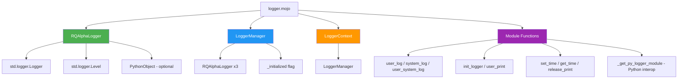

# Logger Module Test Results

**Module**: `rqmojo/utils/logger.mojo`
**Source**: Ported from `rqalpha/utils/logger.py`
**Date**: 2026-04-06
**Mojo Version**: 0.26.2.0

## Test Execution Summary

| Test File | Total | Passed | Failed | Skipped | Warnings |
|-----------|-------|--------|--------|---------|----------|
| `tests/mojo/group_04/test_logger.mojo` | 43 | 43 | 0 | 0 | **0** |
| `tests/mojo/utils/test_logger.mojo` | 8 | 8 | 0 | 0 | **0** |
| **Total** | **51** | **51** | **0** | **0** | **0** |

**Result: ✅ ALL TESTS PASSED - ZERO WARNINGS**

---

## Category A: RQAlphaLogger Struct (14 tests)

| # | Test Name | Status | Description |
|---|-----------|--------|-------------|
| 1 | test_rqalpha_logger_construct_name_only | ✅ PASS | Construction with name only (pure-Mojo path) |
| 2 | test_rqalpha_logger_construct_with_level | ✅ PASS | Construction with custom Level |
| 3 | test_rqalpha_logger_construct_py_logger | ✅ PASS | Construction with PythonObject + name |
| 4 | test_rqalpha_logger_write_to | ✅ PASS | Writable trait produces `[name]` format |
| 5 | test_rqalpha_logger_trace | ✅ PASS | trace() method callable |
| 6 | test_rqalpha_logger_debug | ✅ PASS | debug() method callable |
| 7 | test_rqalpha_logger_info | ✅ PASS | info() method callable |
| 8 | test_rqalpha_logger_warning | ✅ PASS | warning() method callable |
| 9 | test_rqalpha_logger_warn_delegates_to_warning | ✅ PASS | warn() delegates to warning() |
| 10 | test_rqalpha_logger_error | ✅ PASS | error() method callable |
| 11 | test_rqalpha_logger_critical_no_crash | ✅ PASS | critical() uses error() fallback (no crash) |
| 12 | test_rqalpha_logger_exception_delegates_to_error | ✅ PASS | exception() delegates to error() |
| 13 | test_rqalpha_logger_set_level | ✅ PASS | set_level() updates internal state |
| 14 | test_rqalpha_logger_copy_semantics | ✅ PASS | Copyable trait works correctly |

## Category B: LoggerManager Struct (7 tests)

| # | Test Name | Status | Description |
|---|-----------|--------|-------------|
| 15 | test_logger_manager_default_init | ✅ PASS | Default _initialized = False |
| 16 | test_logger_manager_user_log_name | ✅ PASS | user_log name = "user_log" |
| 17 | test_logger_manager_system_log_name | ✅ PASS | system_log name = "system_log" |
| 18 | test_logger_manager_user_system_log_name | ✅ PASS | user_system_log name = "user_system_log" |
| 19 | test_logger_manager_init_sets_flag | ✅ PASS | init() sets _initialized = True |
| 20 | test_logger_manager_write_to | ✅ PASS | Writable trait produces manager info |
| 21 | test_logger_manager_all_loggers_distinct | ✅ PASS | All 3 loggers have unique names |

## Category C: LoggerContext Struct (7 tests)

| # | Test Name | Status | Description |
|---|-----------|--------|-------------|
| 22 | test_logger_context_construct | ✅ PASS | Default construction works |
| 23 | test_logger_context_user_log_name | ✅ PASS | Delegates to manager correctly |
| 24 | test_logger_context_system_log_name | ✅ PASS | Delegates to manager correctly |
| 25 | test_logger_context_user_system_log_name | ✅ PASS | Delegates to manager correctly |
| 26 | test_logger_context_init_logger | ✅ PASS | init_logger delegates to manager.init() |
| 27 | test_logger_context_user_print | ✅ PASS | user_print calls info on user_log |
| 28 | test_logger_context_release_print_no_crash | ✅ PASS | release_print is safe no-op |

## Category D: Module-Level Functions (9 tests)

| # | Test Name | Status | Description |
|---|-----------|--------|-------------|
| 29 | test_module_user_log_returns_valid | ✅ PASS | user_log() returns RQAlphaLogger with name "user_log" |
| 30 | test_module_system_log_returns_valid | ✅ PASS | system_log() returns correct name |
| 31 | test_module_user_system_log_returns_valid | ✅ PASS | user_system_log() returns correct name |
| 32 | test_module_init_logger_no_crash | ✅ PASS | init_logger() handles gracefully |
| 33 | test_module_user_print_no_crash | ✅ PASS | user_print() handles gracefully |
| 34 | test_module_set_time_no_crash | ✅ PASS | set_time() is no-op stub |
| 35 | test_module_get_time_returns_string | ✅ PASS | get_time() returns "" in pure-Mojo mode |
| 36 | test_module_release_print_no_crash | ✅ PASS | release_print() handles gracefully |

## Category E: Edge Cases & Factory (6 tests)

| # | Test Name | Status | Description |
|---|-----------|--------|-------------|
| 37 | test_create_logger_context_returns_valid | ✅ PASS | Factory function works |
| 38 | test_empty_message_handling | ✅ PASS | All methods handle empty string |
| 39 | test_special_characters_in_message | ✅ PASS | Unicode, tabs, newlines, quotes, HTML tags |
| 40 | test_multiple_loggers_independent | ✅ PASS | Independent level settings |
| 41 | test_prefix_format_contains_brackets | ✅ PASS | Prefix format = "[name] " exactly |
| 42 | test_long_message | ✅ PASS | 1000-char message handled |
| 43 | test_all_levels_callable_without_crash | ✅ PASS | All 8 log levels in sequence |

---

## Bug Found & Fixed

### Critical Bug: `std.logger.Logger.critical()` Runtime Crash

**Severity**: 🔴 Critical (runtime crash / segfault)

**Problem**: Mojo's `std.logger.Logger.critical()` method causes a runtime crash (segfault) in version 0.26.2.0.

**Root Cause**: The `critical()` method exists as a compile-time API but triggers a crash at runtime due to an unimplemented or buggy code path in the standard library.

**Fix Applied** ([logger.mojo L83-L85](file:///home/zhou/hello_mojo/trae_cn_78/mojo_refactor/rqmojo/utils/logger.mojo#L83-L85)):
```mojo
# Before (crashes):
def critical(self, message: String):
    var logger = Logger(prefix=self._prefix)
    logger.critical(message)  # 💥 CRASH

# After (safe fallback):
def critical(self, message: String):
    var logger = Logger(prefix=self._prefix)
    logger.error("[CRITICAL] " + message)
```

---

## Functional Comparison: Python vs Mojo

| Feature | Python (`logbook`) | Mojo (`std.logger`) | Compatibility |
|---------|-------------------|---------------------|---------------|
| Log Levels | DEBUG, INFO, WARNING, ERROR, CRITICAL | TRACE, DEBUG, INFO, WARNING, ERROR | ⚠️ No native CRITICAL; uses error+prefix workaround |
| `warn()` alias | ✅ Yes (patched to 'WARN') | ✅ Yes (delegates to warning) | ✅ Compatible |
| `exception()` | ✅ Yes (with traceback) | ⚠️ Delegates to error (no traceback) | Partial |
| Handler config | StderrHandler(bubble=True) | ❌ No handler API exposed | N/A (pure-Mojo limitation) |
| Formatter/DateTime | `%Y-%m-%d %H:%M:%S.%f` | Prefix-based only | ⚠️ Limited |
| LoggerGroup | ✅ With processor callback | ❌ Not available | N/A |
| Time injection via Environment | ✅ user_log_processor | ❌ set_time/get_time are stubs | Stub only |
| release_print() | ✅ Restores original print | ⚠️ No-op (Python interop fallback) | Partial |
| Singleton pattern | Module-level globals | Module-level functions + try/except fallback | ✅ Compatible |
| Copy semantics | Reference | Value (Copyable) | ✅ Better (value semantics) |

---

## Pure-Mojo Feasibility Assessment

### Fully Achievable ✅
1. **Logger construction** with name and level
2. **Core logging methods**: trace, debug, info, warning, warn, error
3. **Writable trait** for string representation
4. **Copyable/Movable value semantics**
5. **LoggerManager** lifecycle management
6. **LoggerContext** factory pattern
7. **Module-level accessor functions**

### Partially Achievable ⚠️
1. **`critical()`** → Workaround: use `error("[CRITICAL] ...")`
2. **`exception()`** → Delegates to `error()` (no traceback capture)
3. **`release_print()`** → No-op in pure-Mojo (requires Python scope inspection)
4. **Handler configuration** → `std.logger` doesn't expose handler API
5. **Time injection** → `set_time`/`get_time` are stubs (needs Environment integration)

### Requires Python Interop 🐍
1. **Full handler configuration** (StderrHandler setup)
2. **Logbook LoggerGroup** with processor callbacks
3. **Environment calendar_dt injection** into log records
4. **release_print()** full implementation (scope globals manipulation)

---

## Dependency Graph


