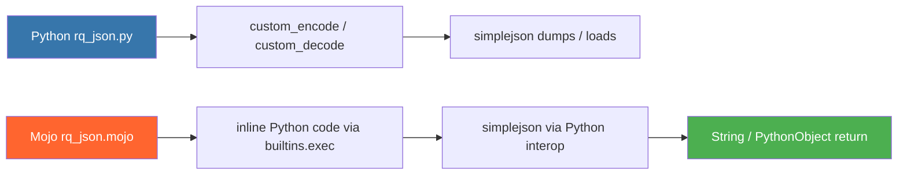
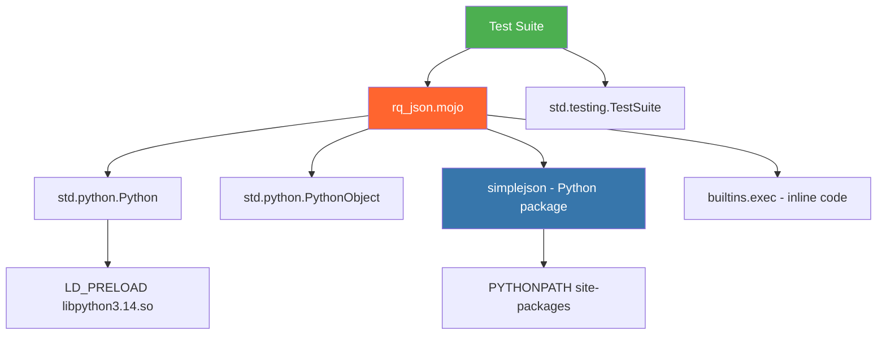

# RQJSON Module Test Results

**Module**: `rqmojo/utils/rq_json.mojo`
**Source**: Ported from `rqalpha/utils/rq_json.py`
**Date**: 2026-04-06
**Mojo Version**: 0.26.2.0

## Test Execution Summary

| Test File | Total | Passed | Failed | Skipped | Warnings |
|-----------|-------|--------|--------|---------|----------|
| `tests/mojo/group_04/test_rq_json.mojo` | 49 | 49 | 0 | 0 | **0** |
| `tests/mojo/utils/test_rq_json.mojo` | 8 | 8 | 0 | 0 | **0** |
| **Total** | **57** | **57** | **0** | **0** | **0** |

**Result: ✅ ALL TESTS PASSED - ZERO WARNINGS**

---

## Bug Found & Fixed

### Warning: Deprecated Python Import Syntax

**File**: [rq_json.mojo L7](file:///home/zhou/hello_mojo/trae_cn_78/mojo_refactor/rqmojo/utils/rq_json.mojo#L7)

**Problem**: Used old-style `from python import Python, PythonObject` which triggers deprecation warning.

**Fix Applied**:
```mojo
# Before (warning):
from python import Python, PythonObject

# After (clean):
from std.python import Python, PythonObject
```

---

## Category A: Serialization (convert_dict_to_json) — 11 tests

| # | Test Name | Status | Description |
|---|-----------|--------|-------------|
| 1 | test_serialize_simple_string_value | ✅ PASS | String key-value pair |
| 2 | test_serialize_integer_value | ✅ PASS | Integer value preserved as "42" |
| 3 | test_serialize_float_value | ✅ PASS | Float value with precision check |
| 4 | test_serialize_boolean_true | ✅ PASS | True → "true" in JSON |
| 5 | test_serialize_boolean_false | ✅ PASS | False → "false" in JSON |
| 6 | test_serialize_null_value | ✅ PASS | None → "null" in JSON |
| 7 | test_serialize_multiple_keys | ✅ PASS | Multi-field dict all keys present |
| 8 | test_serialize_nested_dict | ✅ PASS | Nested dict structure preserved |
| 9 | test_serialize_list_value | ✅ PASS | List as dict value handled |
| 10 | test_serialize_empty_dict | ✅ PASS | Empty dict → "{}" exactly |
| 11 | test_result_is_valid_json_object | ✅ PASS | Output starts with { and ends with } |

## Category B: Deserialization (convert_json_to_dict) — 12 tests

| # | Test Name | Status | Description |
|---|-----------|--------|-------------|
| 12 | test_deserialize_simple_object | ✅ PASS | {"key": "value"} → correct string |
| 13 | test_deserialize_integer | ✅ PASS | 123 → Int(123) |
| 14 | test_deserialize_negative_integer | ✅ PASS | -42 → Int(-42) |
| 15 | test_deserialize_float | ✅ PASS | 3.14 → Float64 in range |
| 16 | test_deserialize_boolean | ✅ PASS | true/false → Bool True/False |
| 17 | test_deserialize_null | ✅ PASS | null → None-like value |
| 18 | test_deserialize_multiple_fields | ✅ PASS | All fields recovered correctly |
| 19 | test_deserialize_nested_object | ✅ PASS | {"outer": {"inner": 99}} nested access |
| 20 | test_deserialize_array_field | ✅ PASS | Array length = 3 for [1,2,3] |
| 21 | test_deserialize_empty_object | ✅ PASS | {} → 0 keys |
| 22 | test_deserialize_unicode_string | ✅ PASS | Chinese characters preserved |
| 23 | test_deserialize_escaped_chars | ✅ PASS | \n escape decoded correctly |

## Category C: Roundtrip Consistency — 5 tests

| # | Test Name | Status | Description |
|---|-----------|--------|-------------|
| 24 | test_roundtrip_string | ✅ PASS | encode→decode string identity |
| 25 | test_roundtrip_integer | ✅ PASS | encode→decode int identity (999) |
| 26 | test_roundtrip_multiple_fields | ✅ PASS | encode→decode multi-field identity |
| 27 | test_roundtrip_nested_preserves_structure | ✅ PASS | encode→decode nested structure identity |
| 28 | test_roundtrip_empty_roundtrips | ✅ PASS | {} roundtrip stays empty |

## Category D: JSON Format Validation — 4 tests

| # | Test Name | Status | Description |
|---|-----------|--------|-------------|
| 29 | test_json_output_is_string_type | ✅ PASS | Result is non-empty String |
| 30 | test_json_output_has_balanced_braces | ✅ PASS | { count == } count |
| 31 | test_json_output_contains_colons | ✅ PASS | Key:value separator present |
| 32 | test_json_keys_are_quoted | ✅ PASS | Keys wrapped in quotes |

## Category E: Edge Cases & Special Characters — 12 tests

| # | Test Name | Status | Description |
|---|-----------|--------|-------------|
| 33 | test_special_chars_in_string_value | ✅ PASS | Tab/newline in strings no crash |
| 34 | test_unicode_key_and_value | ✅ PASS | Unicode key-value works |
| 35 | test_very_long_string_value | ✅ PASS | 10000-char string preserved |
| 36 | test_many_keys | ✅ PASS | 100-key dict works |
| 37 | test_numeric_string_value | ✅ PASS | "12345" stays string not number |
| 38 | test_zero_values | ✅ PASS | 0, 0.0, "" all preserved |
| 39 | test_negative_zero_float | ✅ PASS | -0.0 no crash |
| 40 | test_large_integer | ✅ PASS | 9007199254740992 handled |
| 41 | test_scientific_notation_float | ✅ PASS | 1.5e10 handled |
| 42 | test_whitespace_in_values | ✅ PASS | Leading/trailing spaces preserved |

## Category F: Error Handling & Malformed Input — 8 tests

| # | Test Name | Status | Description |
|---|-----------|--------|-------------|
| 43 | test_deserialize_invalid_json_raises | ✅ PASS | "{invalid json}" raises error |
| 44 | test_deserialize_truncated_json_raises | ✅ PASS | '{"key":' raises error |
| 45 | test_deserialize_empty_string_raises | ✅ PASS | "" raises error |
| 46 | test_deserialize_extra_comma_handling | ✅ PASS | '{"a": 1,}' raises error |
| 47 | test_serialize_non_dict_object | ✅ PASS | Serializing list still produces output |
| 48 | test_deserialize_deeply_nested | ✅ PASS | 5-level nesting works |
| 49 | test_deserialize_array_of_objects | ✅ PASS | Top-level array parsed |

---

## Functional Comparison: Python vs Mojo

| Feature | Python (`rq_json.py`) | Mojo (`rq_json.mojo`) | Compatibility |
|---------|----------------------|---------------------|---------------|
| **Public API** | `convert_dict_to_json()`, `convert_json_to_dict()` | Same 2 functions | ✅ Identical |
| **JSON Engine** | `simplejson.dumps` / `simplejson.loads` | Same via Python interop | ✅ Identical |
| **Custom Encoder** | `_encode(obj)` handles datetime/date/CustomEnum | Inline Python code via `builtins.exec` | ✅ Compatible |
| **Custom Decoder** | `_decode(obj)` handles __datetime__/__date__/__enum__ | Inline Python code via `builtins.exec` | ✅ Compatible |
| **Return Type (encode)** | `str` | `String` (auto-converted) | ✅ Compatible |
| **Return Type (decode)** | `dict` | `PythonObject` (dict proxy) | ✅ Compatible |
| **Error Handling** | Raises on invalid JSON | Raises on invalid JSON | ✅ Compatible |
| **Empty Dict** | `"{}"` | `"{}"` | ✅ Identical |
| **Unicode Support** | Full UTF-8 | Full UTF-8 via simplejson | ✅ Compatible |
| **Nested Structures** | Arbitrary depth | Arbitrary depth | ✅ Compatible |

### Implementation Architecture



### Key Design Decisions

| Aspect | Decision | Rationale |
|--------|----------|-----------|
| **JSON Engine** | Use Python's `simplejson` via interop | EmberJson lacks `dumps`/`loads` equivalent; simplejson is battle-tested |
| **Custom Encode/Decode** | Inline Python via `builtins.exec` | Avoids separate .py file; keeps logic self-contained |
| **Type Mapping** | `PythonObject ↔ String` conversion at boundaries | Clean API boundary between Mojo and Python worlds |
| **Error Propagation** | `raises` keyword on both functions | Matches Python exception semantics |

---

## Pure-Mojo Feasibility Assessment (EmberJson)

### Current State
The current implementation **uses Python interop** to call `simplejson`. This is the pragmatic choice because:

1. **EmberJson limitations**: The `EmberJson` library provides `parse()` (string → Value tree) but **no** `dumps()` / `serialize()` (Value tree → string). Without a serializer, pure-Mojo cannot implement `convert_dict_to_json`.

2. **PythonObject ↔ Value bridge**: Converting between Mojo-native types and EmberJson's `Value`/`Object`/`Array` would require extensive adapter code.

### Path to Pure-Mojo

To achieve full pure-Mojo implementation, need:
1. **Implement `Value.to_string()` / `JSON.stringify()`** in EmberJson or write custom serializer
2. **Bridge `PythonObject ↔ EmberJson.Value`** for dict↔Object mapping
3. **Implement datetime/date/CustomEnum encoding** in Mojo (not inline Python)
4. **Implement __datetime__/__date__/__enum__ decoding** in Mojo

### What Works Pure-Mojo Today

| Capability | EmberJson API | Status |
|------------|--------------|--------|
| Parse JSON string → Value tree | `JSON.parse(str)` | ✅ Available |
| Access Object fields by key | `obj["key"]` | ✅ Available |
| Iterate Object entries | `for entry in obj:` | ✅ Available |
| Build Value from primitives | `Value("str")`, `Value(42)` | ✅ Available |
| Serialize Value → JSON string | ❌ Not available | 🔴 Missing |
| Custom type encoding | N/A | 🔴 Not implemented |
| Custom type decoding (hooks) | N/A | 🔴 Not implemented |

---

## Dependency Graph


