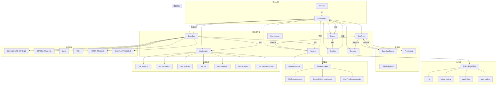

# RQAlpha 系统结构图

## 核心架构

## 模块说明

### 核心组件

1. **Environment**
   - 中央注册表，管理所有系统组件
   - 单例模式，通过 `Environment.get_instance()` 访问
   - 包含事件总线、数据代理、策略、执行器等核心组件

2. **EventBus**
   - 事件驱动架构的核心
   - 管理事件的发布和订阅
   - 支持自定义事件和系统事件

3. **DataProxy**
   - 数据访问的统一接口
   - 封装了底层数据源的访问细节
   - 提供市场数据查询功能

4. **Strategy**
   - 封装用户策略代码
   - 管理策略的生命周期
   - 处理策略的初始化、交易前、交易中、交易后逻辑

5. **Executor**
   - 执行策略的核心引擎
   - 协调策略和事件源
   - 管理策略的执行流程

6. **Portfolio**
   - 管理投资组合和账户
   - 处理资金和持仓
   - 计算绩效指标

7. **Broker**
   - 执行订单的接口
   - 模拟交易或连接实盘
   - 管理订单状态

8. **EventSource**
   - 事件源，生成市场事件
   - 控制回测的时间推进
   - 提供Bar或Tick数据

9. **ModHandler**
   - 模块管理器
   - 负责模块的启动和关闭
   - 管理系统内置模块和自定义模块

### 数据层

1. **BaseDataSource**
   - 数据源的抽象接口
   - 提供市场数据的访问方法
   - 支持本地数据和远程数据

2. **PriceBoard**
   - 价格看板，维护当前市场价格
   - 为策略提供实时价格信息

3. **数据文件/HDF5**
   - 存储市场数据的文件格式
   - 包含股票、基金等金融产品的历史数据

### 策略层

1. **StrategyContext**
   - 策略上下文，提供给策略函数的参数
   - 包含策略运行所需的各种信息

2. **StrategyLoader**
   - 策略加载器的抽象接口
   - 支持从文件、源代码或函数加载策略

3. **具体加载器**
   - FileStrategyLoader：从文件加载策略
   - SourceCodeStrategyLoader：从源代码加载策略
   - UserFuncStrategyLoader：从用户函数加载策略

### 执行层

1. **策略生命周期管理**
   - init：策略初始化
   - before_trading：每个交易日开始前调用
   - handle_bar：每个Bar或Tick调用
   - after_trading：每个交易日结束后调用

### 模块系统

1. **sys_accounts**
   - 账户和持仓管理
   - 处理资金和持仓的变动

2. **sys_simulation**
   - 模拟交易引擎
   - 处理订单执行和成交

3. **sys_analyser**
   - 绩效分析和报告
   - 计算收益率、风险指标等

4. **sys_risk**
   - 风险管理和订单验证
   - 防止策略过度交易

5. **sys_scheduler**
   - 定时任务执行
   - 支持策略中的定时操作

6. **sys_progress**
   - 进度显示
   - 显示回测或实盘的进度

7. **sys_transaction_cost**
   - 交易成本计算
   - 计算佣金、印花税等交易成本

### 事件系统

1. **PRE_BEFORE_TRADING**
   - 交易前准备事件

2. **BEFORE_TRADING**
   - 交易开始事件

3. **BAR**
   - K线数据事件

4. **TICK**
   - tick数据事件

5. **AFTER_TRADING**
   - 交易结束事件

6. **POST_SETTLEMENT**
   - 结算后事件

## 数据流向

1. **数据查询**：策略通过DataProxy查询市场数据
2. **订单提交**：策略通过Environment提交订单
3. **订单验证**：Environment验证订单合法性
4. **订单执行**：Broker执行订单
5. **持仓更新**：Portfolio更新持仓和资金
6. **事件触发**：EventBus触发相应事件
7. **事件通知**：策略和模块接收事件通知
8. **策略执行**：策略根据事件执行相应逻辑

## 执行流程

1. **初始化**：创建Environment，加载配置
2. **启动模块**：ModHandler启动各个模块
3. **加载策略**：StrategyLoader加载策略代码
4. **初始化策略**：执行策略的init方法
5. **运行回测**：Executor运行策略，处理事件
6. **结束回测**：ModHandler关闭各个模块，生成报告

## 核心特性

1. **事件驱动**：基于事件的架构，模块通过订阅事件扩展功能
2. **模块化**：通过Mod系统实现功能扩展
3. **可扩展性**：提供抽象接口，支持自定义实现
4. **数据驱动**：支持多种数据源，包括本地数据和远程数据
5. **灵活性**：支持多种策略加载方式，适应不同场景

## 技术栈

- **Python**：主要开发语言
- **HDF5**：数据存储格式
- **事件驱动**：架构设计模式
- **模块化**：系统设计理念
- **插件系统**：功能扩展机制